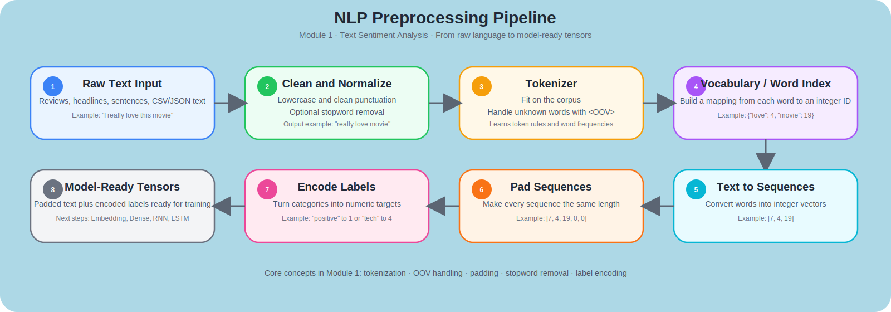

# Module 1 - Text Sentiment Analysis

> **From Raw Sentences to Model-Ready Sequences**: Building the preprocessing foundation for NLP with tokenization, out-of-vocabulary handling, padding, stopword removal, and label encoding in TensorFlow.

[](https://www.tensorflow.org/) [](https://keras.io/) [](https://www.python.org/) [](#)


---

## Table of Contents

1. [Overview](#-overview)
2. [Learning Objectives](#-learning-objectives)
3. [Pipeline at a Glance](#-pipeline-at-a-glance)
4. [Why This Project Matters](#-why-this-project-matters)
5. [Skills Demonstrated](#️-skills-demonstrated)
6. [How to Run](#️-how-to-run)
7. [Problem Statement](#-problem-statement)
8. [Datasets](#-datasets)
9. [Technical Implementation](#️-technical-implementation)
10. [What I Learned](#-what-i-learned)
11. [Notebooks & Exercises](#-notebooks--exercises)
12. [Limitations](#-limitations)
13. [Further Reading](#-further-reading)

---

## 🧭 Overview

This module introduces the **first essential step in Natural Language Processing**

> How do we convert human language into something a neural network can understand?

Unlike images, text cannot be fed directly into a model. A sentence such as:

```text
"I really love this movie"
```

must first be transformed into a sequence of numbers before it can be used for training.

In this module, the focus is not yet on building large sequence models, but on constructing the **text preprocessing pipeline** that makes all later NLP models possible.

This includes:

- Tokenizing words into integer IDs
- Creating a vocabulary from raw text
- Handling unseen words with `<OOV>`
- Padding variable-length sequences
- Preprocessing real-world text datasets from JSON and CSV files
- Encoding text labels into numerical form

This module serves as the **foundation for sentiment analysis, text classification, and sequence modeling**.

---

## 🎯 Learning Objectives

By the end of this module, you will understand how to:

- Convert raw text into tokenized numerical sequences
- Build a vocabulary using Keras `Tokenizer`
- Handle unseen words with the `oov_token` mechanism
- Normalize variable-length inputs using `pad_sequences`
- Work with real-world NLP datasets stored in JSON and CSV formats
- Remove stopwords from raw text
- Encode labels for supervised NLP tasks
- Prepare text data for downstream deep learning architectures such as embeddings, RNNs, and sequence models

---

## 🖼️ Pipeline at a Glance


<p align="center">
  
  <br>
  <em>Module 1 NLP preprocessing pipeline.</em>
</p>

### Simple Example — How the Pipeline Works

Below is a small example showing how raw text becomes model-ready input.

**Raw sentence**

```text
"I really love this movie"
```

**After text cleaning**

```text
"I really love movie"
```

**Possible word index**

```python
{
  "really": 7,
  "love": 4,
  "movie": 19
}
```

**Converted to sequence**

```python
[7, 4, 19]
```


**After padding (`maxlen=5`)**

```python
[7, 4, 19, 0, 0]
```


**Example label encoding**

```python
"positive" -> 1
```

This is the core idea of Module 1:

> raw language → cleaned text → tokens → padded sequences → labels → model-ready tensors

---

## 💼 Why This Project Matters

Real-world NLP systems do not start with perfect tensors. They start with **messy text**.

Examples include:

- Customer reviews
- News headlines
- Tweets and social media posts
- Chatbot messages
- Support tickets
- Survey responses

Before any model can perform sentiment analysis or classification, the data must be transformed into a structured format.

This module demonstrates practical, production-relevant NLP skills:

- Text preprocessing
- Vocabulary engineering
- Sequence normalization
- Label encoding
- Scalable dataset preparation

These are fundamental skills for roles in:

- Machine Learning Engineering
- Data Science
- NLP Engineering
- Applied AI

---

## 👥 Who This Module Is For

This module is designed for:

- Developers starting NLP with TensorFlow
- Data Scientists transitioning from tabular or image problems into text
- Students learning how sentiment analysis pipelines begin
- Practitioners who want to understand tokenization before sequence models
- Anyone building a portfolio in NLP or deep learning

If later modules focus on **embeddings, sequence models, and literature generation**, this module focuses on **the preprocessing layer everything depends on**.

---

## 🛠️ Skills Demonstrated

### 1️⃣ Text Tokenization
- Converting sentences into sequences of integer IDs
- Building a word-index mapping
- Understanding how vocabulary size affects representation

### 2️⃣ Out-of-Vocabulary (OOV) Handling
- Using `<OOV>` to handle unseen words gracefully
- Preventing model failures when new text contains unknown vocabulary

### 3️⃣ Sequence Padding
- Standardizing text inputs to the same length
- Making variable-length natural language compatible with neural network training

### 4️⃣ Text Cleaning
- Removing stopwords from real-world news text
- Reducing noise in raw textual data

### 5️⃣ Label Encoding
- Turning string-based labels into numerical sequences
- Preparing supervised datasets for classification tasks

### 6️⃣ Real-World Dataset Processing
- Loading JSON-based text datasets
- Loading CSV-based text datasets
- Extracting sentences, labels, and metadata into usable Python structures

---

## ⚠️ Common Mistakes Explored in This Module

- **Treating Text Like Numeric Data**
  - Neural networks cannot learn directly from raw strings.
  - Text must first be tokenized and encoded.

- **Ignoring Unknown Words**
  - Real-world data always contains words not seen during training.
  - Without an OOV token, the preprocessing pipeline becomes fragile.

- **Forgetting to Pad Sequences**
  - Sentences vary in length.
  - Models require consistent tensor shapes for training.

- **Overlooking Stopword Noise**
  - Common words such as `the`, `is`, and `and` may dominate the vocabulary without adding useful signal.

- **Misunderstanding Label Preparation**
  - Text labels also need numerical encoding before supervised learning can happen.

- **Assuming Preprocessing Is “Just Setup”**
  - In NLP, preprocessing is not a side task.
  - It directly affects vocabulary quality, generalization, and downstream model performance.

---

## ▶️ How to Run

This module consists of Jupyter notebooks that can be run locally or on Google Colab.

### Prerequisites

- Python 3.8 or higher
- pip
- Virtual environment support (recommended)
- TensorFlow 2.x

### 1. Clone the Repository

```bash
git clone https://github.com/victorperone/Natural_Language_Processing_in_Tensorflow.git
cd Natural_Language_Processing_in_Tensorflow/Module1_Text_Sentiment_Analysis
```

### 2. Create and Activate a Virtual Environment (Recommended)

**Linux / macOS**
```bash
python3 -m venv venv
source venv/bin/activate
```

**Windows**
```bash
python -m venv venv
venv\Scripts\activate
```

### 3. Install Dependencies

If you are using a `requirements.txt` file:

```bash
pip install -r requirements.txt
```

Or install the essentials manually:

```bash
pip install tensorflow numpy matplotlib jupyter
```

### 4. Launch Jupyter Notebook

```bash
jupyter notebook
```

or:

```bash
jupyter lab
```

### 5. Run on Google Colab

You can also run the notebooks without local setup using **Google Colab**.

1. Open [Google Colab](https://colab.research.google.com)
2. Click **File → Open notebook**
3. Select the **GitHub** tab
4. Paste your repository URL
5. Open the notebook you want to run

⚠️ **Note:** If `requirements.txt` is not automatically handled, install dependencies in a Colab cell:

```python
!pip install tensorflow numpy matplotlib
```

---

## 🧪 Reproducibility Note

This module is primarily focused on **deterministic preprocessing steps**, so results are generally reproducible.

However, some values may vary slightly depending on:

- TensorFlow / Keras version
- Tokenizer configuration
- Text cleaning rules
- Whether stopword filtering is enabled before tokenization

Overall, the main trends and outputs should remain consistent:

- Vocabulary building
- Text-to-sequence conversion
- Padding behavior
- Label encoding structure

---

## ❓ Problem Statement

Natural language is not naturally compatible with deep learning models.

A neural network cannot process:

```text
"this movie was fantastic"
```

the same way it processes a numeric tensor.

### The challenge in this module is:

How do we convert messy, variable-length, real-world text into a structured, numerical format that can later be used by sentiment models and sequence architectures?

To solve this, we need a preprocessing pipeline that can:

- Map words to integers
- Handle vocabulary growth
- Deal with unseen tokens
- Normalize sentence length
- Encode labels numerically
- Scale from toy examples to real datasets

This is the exact pipeline that underpins later tasks such as:

- Sentiment analysis
- News classification
- Sarcasm detection
- Spam detection
- Intent classification

---

## 💾 Datasets

This module progresses from small conceptual examples to real-world NLP datasets.

### 1️⃣ Toy Sentence Examples
Used to illustrate:

- How tokenization works
- How vocabulary maps are created
- How punctuation and repeated words affect the tokenizer

These examples are intentionally simple so the core mechanics are easy to understand.

---

### 2️⃣ Sarcasm Headlines Dataset
A JSON dataset containing news headlines and sarcasm labels.

Used to demonstrate:

- Loading text from structured JSON
- Extracting headlines and labels
- Building a tokenizer on real text
- Converting a large text corpus into padded sequences

This is the first point in the module where preprocessing moves from controlled examples to more realistic text.

---

### 3️⃣ BBC News Text Dataset
A CSV dataset used in the exercise notebook.

It demonstrates how to:

- Load labeled text data from CSV
- Remove stopwords
- Tokenize cleaned sentences
- Build vocabulary mappings
- Pad all sequences to a consistent length
- Encode category labels numerically

### Exercise Output Highlights

From the preprocessing pipeline, the exercise produces:

- **2,225 text samples**
- **~29.7k vocabulary size**
- padded text tensor with shape **(2225, 2442)**
- **5 encoded label classes**

This is a strong example of transforming raw text into model-ready input for downstream NLP classification tasks.

---

## 📉 Deep Dive: Why Text Preprocessing Matters

### 1️⃣ Neural Networks Need Numbers, Not Words

A model cannot interpret language directly. It needs each word or token converted into a numeric representation.

Example:

```text
"I love my dog"
```

might become:

```text
[2, 4, 3, 1]
```

This mapping is what makes text computationally tractable.


### 2️⃣ Variable-Length Text Is a Structural Problem

Sentences are not all the same size.

Example:

```text
"I love NLP"
```

vs

```text
"I absolutely love applying natural language processing to real-world products"
```

Without padding, these cannot be stacked into a consistent tensor for training.

`pad_sequences` solves this by enforcing a fixed shape.

### 3️⃣ Unknown Words Are Guaranteed in Real Systems

Real deployments always encounter new vocabulary.

Examples:

- Slang
- Misspellings
- New product names
- Named entities
- Rare terms

Using `<OOV>` ensures the pipeline stays robust instead of breaking or discarding meaning completely.

### 4️⃣ Stopword Removal Can Improve Signal

Words like:

- the
- and
- is
- of

appear frequently but may not carry much meaning for some classification tasks.

In the BBC exercise, stopword removal helps prioritize more informative content words before tokenization.

---

## ⚙️ Technical Implementation

### 1️⃣ Tokenizer Fundamentals

The first lesson introduces Keras `Tokenizer` on small sentences to show how vocabulary is built.

```python
from tensorflow.keras.preprocessing.text import Tokenizer

sentences = [
    'i love my dog',
    'I love my cat',
    'You love my dog!'
]

tokenizer = Tokenizer(num_words=100)
tokenizer.fit_on_texts(sentences)
word_index = tokenizer.word_index
```

This produces a mapping from words to integers.

### 2️⃣ Handling Unknown Words with `<OOV>`

In real-world NLP, unseen words are inevitable.

```python
tokenizer = Tokenizer(num_words=100, oov_token="<OOV>")
tokenizer.fit_on_texts(sentences)
```

This improves generalization by assigning unknown words to a reserved token rather than dropping them.

### 3️⃣ Converting Text into Sequences

Once a tokenizer is fitted, sentences are transformed into numerical sequences.

```python
sequences = tokenizer.texts_to_sequences(sentences)
```

Example output:

```text
[[2, 4, 3, 1], [2, 4, 3, 5], ...]
```

### 4️⃣ Padding Sequences

Since models require fixed-size input tensors, shorter sequences must be padded.

```python
from tensorflow.keras.preprocessing.sequence import pad_sequences

padded = pad_sequences(sequences, padding='post')
```

**Why post-padding?**

- Keeps the original sentence order intact
- Appends zeros at the end
- Commonly used in NLP pipelines before embeddings and sequence models

### 5️⃣ Processing Real-World JSON Text Data

The sarcasm lesson introduces a JSON dataset and extracts:

- `headline`
- `is_sarcastic`
- `article_link`

This demonstrates how raw NLP datasets are often structured and how to isolate the fields needed for training pipelines.

### 6️⃣ Processing Real-World CSV Text Data

The BBC exercise uses a CSV pipeline to:

- read labels and sentences
- clean text with stopword removal
- tokenize the cleaned corpus
- pad the resulting sequences
- encode labels numerically

This workflow closely resembles a real text-classification preprocessing pipeline.

### 7️⃣ End-to-End Preprocessing Example

The snippets above explain each building block separately.  
Below is a compact end-to-end example that combines the main ideas of this module into one readable pipeline:

- text cleaning
- stopword removal
- tokenization
- out-of-vocabulary handling
- sequence conversion
- padding
- label encoding

This example uses a **small toy dataset** so the full preprocessing flow is easy to understand before scaling to the BBC and sarcasm datasets.

```python
# ---------------------------------------------------------
# End-to-End NLP Preprocessing Example
# ---------------------------------------------------------
# This example shows the full pipeline used throughout
# Module 1:
# 1. clean raw text
# 2. remove stopwords
# 3. tokenize text
# 4. handle unknown words with <OOV>
# 5. convert text into sequences
# 6. pad sequences to equal length
# 7. encode labels numerically
# ---------------------------------------------------------

import re
from tensorflow.keras.preprocessing.text import Tokenizer
from tensorflow.keras.preprocessing.sequence import pad_sequences


# ---------------------------------------------------------
# 1. Toy dataset
# ---------------------------------------------------------
# A small set of sentences and labels so we can inspect
# every transformation step clearly.
sentences = [
    "I really love this movie!",
    "This film was fantastic and inspiring.",
    "I did not like this movie at all.",
    "The acting was bad and the story was boring."
]

labels = [
    "positive",
    "positive",
    "negative",
    "negative"
]


# ---------------------------------------------------------
# 2. Stopword list
# ---------------------------------------------------------
# In the real exercise, a much larger stopword list is used.
# Here we keep only a small subset for readability.
stopwords = {
    "i", "this", "was", "and", "the", "at", "all", "did", "not"
}


# ---------------------------------------------------------
# 3. Text cleaning function
# ---------------------------------------------------------
# This function:
# - lowercases the text
# - removes punctuation
# - removes stopwords
# - returns the cleaned sentence
def clean_text(text):
    # Convert text to lowercase so "Movie" and "movie"
    # are treated as the same token
    text = text.lower()

    # Remove punctuation and keep only letters/spaces
    text = re.sub(r"[^a-zA-Z\\s]", "", text)

    # Split the sentence into words
    words = text.split()

    # Remove stopwords
    filtered_words = [word for word in words if word not in stopwords]

    # Join the remaining words back into a string
    return " ".join(filtered_words)


# Apply cleaning to every sentence
cleaned_sentences = [clean_text(sentence) for sentence in sentences]


# ---------------------------------------------------------
# 4. Tokenizer with OOV handling
# ---------------------------------------------------------
# oov_token="<OOV>" ensures that words not seen during
# training are mapped to a reserved token instead of
# breaking the pipeline.
tokenizer = Tokenizer(num_words=100, oov_token="<OOV>")
tokenizer.fit_on_texts(cleaned_sentences)

# Dictionary mapping words to integer IDs
word_index = tokenizer.word_index


# ---------------------------------------------------------
# 5. Convert cleaned text into sequences
# ---------------------------------------------------------
# Each word is replaced by its integer ID.
sequences = tokenizer.texts_to_sequences(cleaned_sentences)


# ---------------------------------------------------------
# 6. Pad sequences
# ---------------------------------------------------------
# Neural networks require consistent input shapes.
# We pad all sequences to the same length.
padded_sequences = pad_sequences(
    sequences,
    maxlen=6,          # fixed length for all sequences
    padding="post",    # add zeros at the end
    truncating="post"  # truncate from the end if too long
)


# ---------------------------------------------------------
# 7. Encode labels numerically
# ---------------------------------------------------------
# Labels like "positive" and "negative" must also be
# converted into numbers before model training.
label_tokenizer = Tokenizer()
label_tokenizer.fit_on_texts(labels)

label_word_index = label_tokenizer.word_index
label_sequences = label_tokenizer.texts_to_sequences(labels)


# ---------------------------------------------------------
# 8. Display outputs
# ---------------------------------------------------------
print("Original Sentences:\\n", sentences, "\\n")
print("Cleaned Sentences:\\n", cleaned_sentences, "\\n")

print("Word Index:\\n", word_index, "\\n")
print("Sequences:\\n", sequences, "\\n")
print("Padded Sequences:\\n", padded_sequences, "\\n")

print("Label Word Index:\\n", label_word_index, "\\n")
print("Encoded Labels:\\n", label_sequences)
```

### 8️⃣ Real Dataset Example — BBC News Preprocessing

The previous example used a very small toy dataset so the preprocessing steps were easy to see.
Below is a **real dataset example**, adapted directly from the BBC News exercise notebook used in this module.

This version shows how the same preprocessing ideas scale to a real NLP workflow:

- loading text from CSV
- removing stopwords
- tokenizing text
- handling unknown words with `<OOV>`
- converting text into sequences
- padding sequences
- encoding labels numerically

```python
# ---------------------------------------------------------
# BBC News Dataset - Real Preprocessing Example
# ---------------------------------------------------------
# This example is adapted from the exercise notebook.
# It shows how raw labeled text is transformed into
# model-ready inputs using the same steps introduced
# throughout Module 1.
#
# If you are running in Google Colab, the dataset can be
# downloaded directly with wget.
# ---------------------------------------------------------

!wget --no-check-certificate \\
    https://storage.googleapis.com/laurencemoroney-blog.appspot.com/bbc-text.csv \\
    -O /tmp/bbc-text.csv

import csv
from tensorflow.keras.preprocessing.text import Tokenizer
from tensorflow.keras.preprocessing.sequence import pad_sequences


# ---------------------------------------------------------
# Stopword list
# ---------------------------------------------------------
# This is the same style used in the exercise notebook.
# Stopwords are very common words that often add little
# useful information for classification tasks.
stopwords = [
    "a", "about", "above", "after", "again", "against", "all", "am", "an", "and",
    "any", "are", "as", "at", "be", "because", "been", "before", "being", "below",
    "between", "both", "but", "by", "could", "did", "do", "does", "doing", "down",
    "during", "each", "few", "for", "from", "further", "had", "has", "have", "having",
    "he", "he'd", "he'll", "he's", "her", "here", "here's", "hers", "herself", "him",
    "himself", "his", "how", "how's", "i", "i'd", "i'll", "i'm", "i've", "if", "in",
    "into", "is", "it", "it's", "its", "itself", "let's", "me", "more", "most", "my",
    "myself", "nor", "of", "on", "once", "only", "or", "other", "ought", "our", "ours",
    "ourselves", "out", "over", "own", "same", "she", "she'd", "she'll", "she's",
    "should", "so", "some", "such", "than", "that", "that's", "the", "their", "theirs",
    "them", "themselves", "then", "there", "there's", "these", "they", "they'd",
    "they'll", "they're", "they've", "this", "those", "through", "to", "too", "under",
    "until", "up", "very", "was", "we", "we'd", "we'll", "we're", "we've", "were",
    "what", "what's", "when", "when's", "where", "where's", "which", "while", "who",
    "who's", "whom", "why", "why's", "with", "would", "you", "you'd", "you'll",
    "you're", "you've", "your", "yours", "yourself", "yourselves"
]


# ---------------------------------------------------------
# 1. Load the dataset
# ---------------------------------------------------------
# The BBC dataset is stored as CSV:
# - row[0] = label/category
# - row[1] = article text
sentences = []
labels = []

with open("/tmp/bbc-text.csv", "r") as csvfile:
    reader = csv.reader(csvfile, delimiter=",")
    next(reader)  # Skip the CSV header row

    for row in reader:
        # Save the label (e.g. tech, sport, business...)
        labels.append(row[0])

        # Get the raw article text
        sentence = row[1].lower()

        # -------------------------------------------------
        # 2. Remove stopwords
        # -------------------------------------------------
        # The logic below is intentionally simple and close
        # to the original exercise notebook.
        for word in stopwords:
            token = " " + word + " "
            sentence = sentence.replace(token, " ")

        # Remove extra spaces that may appear after cleaning
        sentence = " ".join(sentence.split())

        # Save the cleaned sentence
        sentences.append(sentence)


# ---------------------------------------------------------
# 3. Create the tokenizer
# ---------------------------------------------------------
# The OOV token makes the pipeline more robust when
# previously unseen words appear at inference time.
tokenizer = Tokenizer(oov_token="<OOV>")
tokenizer.fit_on_texts(sentences)

# Dictionary: word -> integer ID
word_index = tokenizer.word_index


# ---------------------------------------------------------
# 4. Convert text into sequences
# ---------------------------------------------------------
# Each cleaned sentence becomes a list of integers.
sequences = tokenizer.texts_to_sequences(sentences)


# ---------------------------------------------------------
# 5. Pad the sequences
# ---------------------------------------------------------
# Padding ensures all samples have the same length so they
# can be stacked into a single tensor for training.
padded = pad_sequences(sequences, padding="post")


# ---------------------------------------------------------
# 6. Encode labels numerically
# ---------------------------------------------------------
# Labels are text strings at first, but models need
# numerical targets.
label_tokenizer = Tokenizer()
label_tokenizer.fit_on_texts(labels)

# Dictionary: label -> integer ID
label_word_index = label_tokenizer.word_index

# Convert label strings into numeric sequences
label_sequences = label_tokenizer.texts_to_sequences(labels)


# ---------------------------------------------------------
# 7. Inspect the outputs
# ---------------------------------------------------------
# These prints help us verify that preprocessing worked.
print("Total samples:", len(sentences))
print("First cleaned sentence:", sentences[0][:300], "...")
print("Vocabulary size:", len(word_index))
print("First sequence (first 20 tokens):", sequences[0][:20])
print("Padded tensor shape:", padded.shape)
print("Label mapping:", label_word_index)
print("First 10 encoded labels:", label_sequences[:10])
```

---

## 🧠 What This Module Builds Toward

This module does not stop at preprocessing.

It prepares the groundwork for later modules that introduce:

- Embedding layers
- Sentiment classifiers
- Recurrent neural networks
- Sequence models
- Literature generation models

In other words:

> Module 1 is where raw text becomes learnable.

Without this layer, the rest of the course cannot work.

---

## 📊 Pipeline Outputs and Interpretation

Unlike later modules, this module does not focus on model accuracy curves. Instead, the most important outputs are **data transformation artifacts**.

### Key outputs include:

- Vocabulary dictionaries
- Integer-based sentence sequences
- Padded tensors
- Label-index mappings

### Why these matter

These outputs determine:

- How the model sees language
- Which words are preserved
- How unknown words are handled
- Whether sequences are compatible with training

A weak model can sometimes be improved later.

A weak preprocessing pipeline usually causes problems everywhere downstream.

---

## 📏 Metrics in This Module

There are no major training metrics such as `accuracy` or `val_loss` emphasized here because the module’s main goal is **text representation and preprocessing**, not final model performance.

Instead, the “metrics” of success are:

- Correct vocabulary construction
- Meaningful text-to-sequence conversion
- Proper handling of unknown words
- Consistent padded tensor shapes
- Correct label encoding

These are the structural prerequisites for all later NLP model evaluation.

---

## 🔑 Key Concepts

- Tokenization
- Vocabulary construction
- Text-to-sequence conversion
- Out-of-vocabulary handling
- Padding
- Stopword removal
- Label encoding
- Dataset preprocessing for NLP
- Structured text pipelines in TensorFlow

---

## 💡 What I Learned

- NLP begins with preprocessing, not model architecture
- Tokenization is the bridge between language and neural computation
- OOV handling is essential for real-world robustness
- Padding solves one of the biggest structural problems in text modeling
- Stopword removal can significantly affect vocabulary quality
- Label encoding is just as important as feature preparation
- Real NLP projects depend heavily on clean, consistent preprocessing pipelines

Most importantly:

> Good NLP models start with good text representation.

---

## 📓 Notebooks & Exercises

### Lesson Notebooks
- **Lesson 1**: Introduces the Keras tokenizer with simple example sentences
- **Lesson 2**: Demonstrates OOV tokens and padding for variable-length text
- **Lesson 3**: Applies the preprocessing workflow to a sarcasm headlines dataset stored in JSON format

### Exercise Notebook
- Loads and cleans a BBC news text dataset from CSV
- Removes stopwords
- Builds a tokenizer
- Converts text to sequences
- Pads sequences
- Encodes class labels numerically

Together, these notebooks move from:

**toy examples → real datasets → structured NLP preprocessing pipeline**

---

## 📝 Summary

In this module, I built the preprocessing foundation for NLP in TensorFlow.

I learned how to:

- Tokenize raw text
- Create vocabularies
- Handle unseen words
- Pad variable-length sequences
- Preprocess JSON and CSV text datasets
- Encode labels for classification tasks

This module demonstrates that before building advanced sentiment models or sequence networks, you must first solve the much more fundamental problem of **representing language numerically and consistently**.

---

## 📘 Files in This Module

<pre>
📁 Module1_Text_Sentiment_Analysis
├── 📓 Course_3_Week_1_Lesson_1.ipynb
├── 📓 Course_3_Week_1_Lesson_2.ipynb
├── 📓 Course_3_Week_1_Lesson_3.ipynb
├── 📓 Course_3_Week_1_Exercise_question.ipynb
├── 📓 Course_3_Week_1_Exercise_solution.ipynb
├── 🏗️ module1_nlp_pipeline_polished.svg
├── 📄 requirements.txt
└── 📘 README.md
</pre>

**Legend**

<pre>
📁 Folder 
📓 Jupyter Notebook 
🏗️ Model Architecture / Diagram (.svg) 
📊 Results / Plots (.png) 
🗜️ Compressed Dataset 
📄 Configuration File 
📘 Project Documentation
</pre>

---

## 🛑 Limitations

- This module is focused on preprocessing, not full sentiment model training
- No embedding layer is trained yet
- No RNN/LSTM architecture is introduced yet
- No final classification benchmark is the main objective here
- Stopword removal is task-dependent and may not always improve performance
- Vocabulary quality depends on preprocessing choices

---

## 📚 Further Reading

- [TensorFlow Tokenizer Documentation](https://www.tensorflow.org/api_docs/python/tf/keras/preprocessing/text/Tokenizer)
- [TensorFlow pad_sequences Documentation](https://www.tensorflow.org/api_docs/python/tf/keras/utils/pad_sequences)
- [Word Embeddings Guide](https://www.tensorflow.org/text/guide/word_embeddings)
- [Sequence Models in Keras](https://keras.io/api/layers/recurrent_layers/)
- [NLP with TensorFlow Tutorials](https://www.tensorflow.org/text/tutorials)
