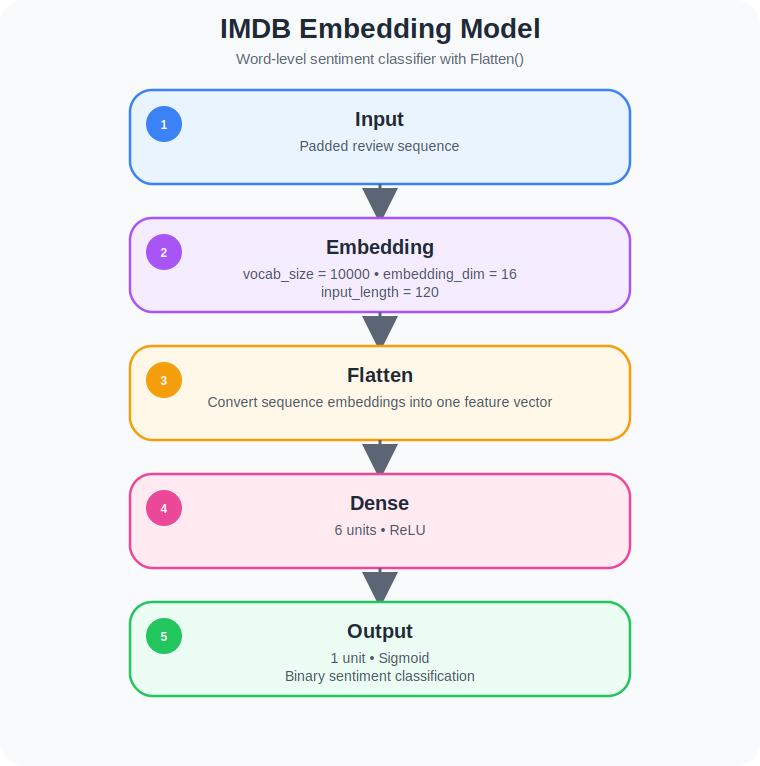
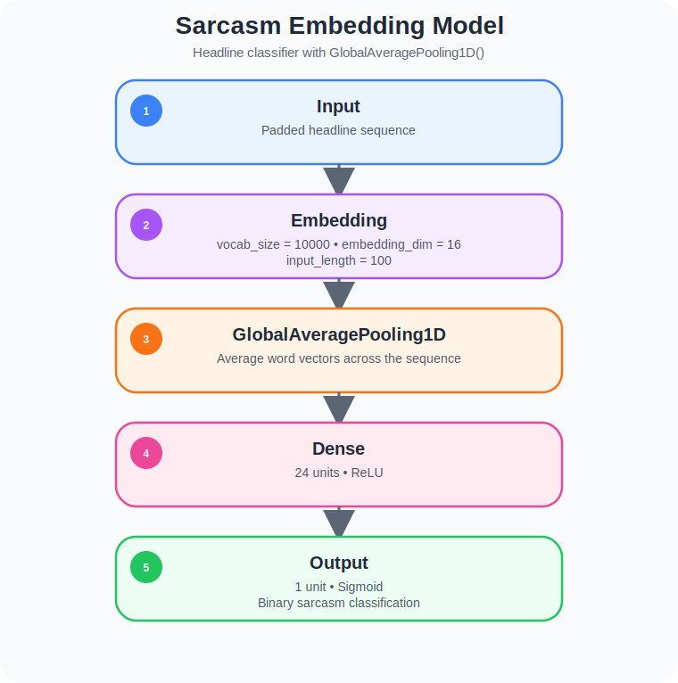
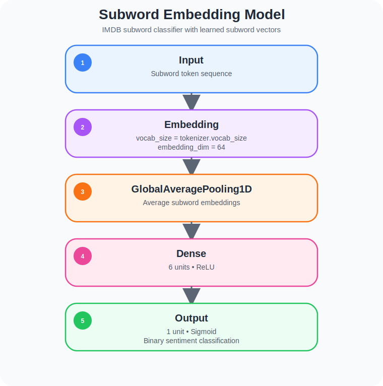
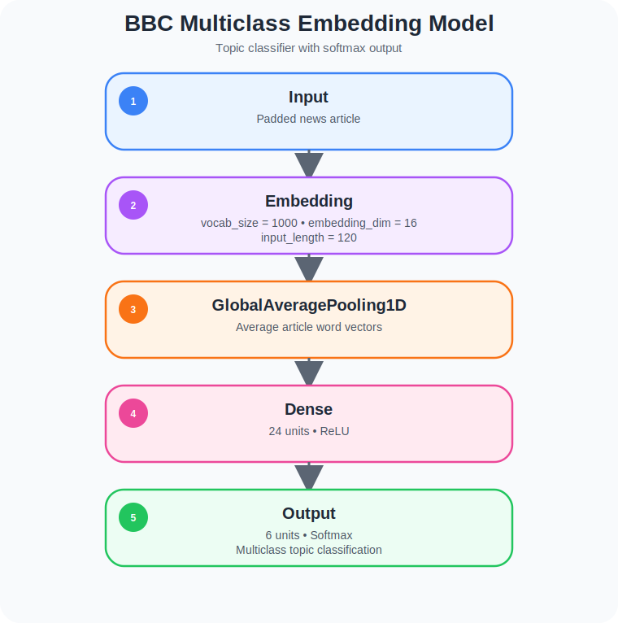

# Module 2 - Word Embedding

> **From Integer Tokens to Semantic Vectors**: Learning dense word representations with TensorFlow, TensorFlow Datasets, subword tokenization, and embedding visualization.

[](https://www.tensorflow.org/) [](https://keras.io/) [](https://www.python.org/) [](#)

---

## Table of Contents

1. [Overview](#-overview)
2. [Learning Objectives](#-learning-objectives)
3. [Why This Project Matters](#-why-this-project-matters)
4. [Who This Module Is For](#-who-this-module-is-for)
5. [Skills Demonstrated](#️-skills-demonstrated)
6. [Common Mistakes Explored in This Module](#️-common-mistakes-explored-in-this-module)
7. [How to Run](#️-how-to-run)
8. [Reproducibility Note](#-reproducibility-note)
9. [Problem Statement](#-problem-statement)
10. [Datasets](#-datasets)
11. [Deep Dive: What Word Embeddings Really Are](#-deep-dive-what-word-embeddings-really-are)
12. [Technical Implementation](#️-technical-implementation)
13. [What This Module Builds Toward](#-what-this-module-builds-toward)
14. [Results and Interpretation](#-results-and-interpretation)
15. [Key Concepts](#-key-concepts)
16. [What I Learned](#-what-i-learned)
17. [Notebooks & Exercises](#-notebooks--exercises)
18. [Files in This Module](#-files-in-this-module)
19. [Limitations](#-limitations)
20. [Further Reading](#-further-reading)

---

## 🧭 Overview

In Module 1, text was transformed into **integer sequences**.  
That solved the first problem in NLP:

> how do we represent language numerically?

But integer IDs alone do **not** carry meaning.

For example:

- `movie = 18`
- `film = 27`

These numbers are different IDs, but they do not tell the model that the two words are semantically related.

This module introduces **word embeddings**, one of the most important ideas in modern NLP.

Instead of representing words as isolated IDs, we learn **dense vectors** that capture relationships between words. Over training, words used in similar contexts begin to occupy nearby positions in vector space.

This module explores:

- `Embedding` layers in TensorFlow/Keras
- Sentiment classification with embeddings
- `Flatten()` vs `GlobalAveragePooling1D()`
- TensorFlow Datasets with IMDB reviews
- Sarcasm headline classification
- Subword tokenization with `imdb_reviews/subwords8k`
- Embedding export to `vecs.tsv` and `meta.tsv`
- Multiclass text classification with BBC News data

This is the module where NLP moves from **basic preprocessing** to **learned language representations**.

---

## 🎯 Learning Objectives

By the end of this module, you will understand how to:

- Use a Keras `Embedding` layer to learn dense word vectors
- Train sentiment classification models using text embeddings
- Compare `Flatten()` and `GlobalAveragePooling1D()` for text models
- Use TensorFlow Datasets (`tfds`) to load NLP benchmarks
- Work with IMDB review data for binary sentiment classification
- Use sarcasm headlines for classification with embeddings
- Apply subword tokenization using `subwords8k`
- Export learned embeddings to `vecs.tsv` and `meta.tsv`
- Train a multiclass embedding model on BBC News text

---

## 💼 Why This Project Matters

Word embeddings are one of the foundational building blocks of practical NLP.

They are used in systems such as:

- Sentiment analysis
- Review classification
- Search relevance
- Recommendation engines
- Topic classification
- Intent detection
- Document clustering
- Semantic similarity systems

This module demonstrates that I understand how to move beyond simple token IDs and build **trainable semantic representations**.

That is an important shift because it shows the transition from:

> “I can preprocess text”

to

> “I can represent language in a way neural networks can learn from”

This module signals practical experience with:

- Text representation learning
- Dataset-driven NLP workflows
- Binary and multiclass text classification
- TensorFlow Datasets
- Embedding export and inspection

---

## 👥 Who This Module Is For

This module is designed for:

- Developers moving from tokenization into learned text representations
- Data Scientists exploring NLP classification beyond preprocessing
- Students learning why embeddings matter in language models
- Practitioners who want to understand dense word vectors before sequence models
- Anyone building an NLP portfolio with TensorFlow

If Module 1 answered:

> “How do we convert text into numbers?”

Module 2 answers:

> “How do we convert text into meaningful vectors?”

---

## 🛠️ Skills Demonstrated

### 1️⃣ Embedding Layer Design
- Built models using `tf.keras.layers.Embedding`
- Learned dense vector representations directly from text
- Controlled vocabulary size, embedding dimension, and input length

### 2️⃣ Binary Sentiment Classification
- Trained binary text classifiers on IMDB and sarcasm data
- Used `sigmoid` output layers with `binary_crossentropy`
- Evaluated training vs validation behavior

### 3️⃣ Sequence Representation Strategies
- Compared `Flatten()` vs `GlobalAveragePooling1D()`
- Explored the tradeoff between model simplicity and parameter efficiency

### 4️⃣ TensorFlow Datasets (TFDS)
- Loaded NLP benchmarks directly from `tensorflow_datasets`
- Worked with:
  - `imdb_reviews`
  - `imdb_reviews/subwords8k`

### 5️⃣ Subword Tokenization
- Used subword encoders instead of pure word-level tokenization
- Handled words more flexibly by breaking them into smaller units
- Improved robustness for rare or unseen words

### 6️⃣ Embedding Visualization Export
- Exported embedding vectors to `vecs.tsv`
- Exported token metadata to `meta.tsv`
- Prepared learned embeddings for visualization in TensorFlow Projector

### 7️⃣ Multiclass Text Classification
- Built a 6-class BBC News classifier
- Used `softmax` outputs and `sparse_categorical_crossentropy`
- Applied embeddings to a real multiclass NLP problem

---

## ⚠️ Common Mistakes Explored in This Module

- **Thinking Token IDs Carry Meaning**
  - Integer IDs are just indexes.
  - Semantic meaning only emerges when embeddings are learned.

- **Using the Wrong Output Layer**
  - Binary sentiment tasks require `sigmoid`.
  - Multiclass tasks require `softmax`.

- **Using the Wrong Loss Function**
  - Binary tasks use `binary_crossentropy`
  - Integer-encoded multiclass tasks use `sparse_categorical_crossentropy`

- **Ignoring Input Length**
  - Embedding models still need fixed-size padded inputs when working with standard dense architectures.

- **Confusing Word-Level and Subword Tokenization**
  - Word tokenizers split on tokens directly.
  - Subword tokenizers break words into smaller meaningful pieces.

- **Assuming Bigger Embeddings Are Always Better**
  - Higher dimensions increase capacity, but also complexity and overfitting risk.

- **Forgetting That Embeddings Can Be Inspected**
  - Exporting learned vectors is valuable for interpretability and portfolio presentation.

---

## ▶️ How to Run

This module consists of Jupyter notebooks that can be run locally or on Google Colab.

### Prerequisites

- Python 3.8 or higher
- pip
- Virtual environment support (recommended)
- TensorFlow 2.x
- TensorFlow Datasets

### 1. Clone the Repository

```bash
git clone https://github.com/victorperone/Natural_Language_Processing_in_Tensorflow.git
cd Natural_Language_Processing_in_Tensorflow/Module2_Word_Embedding
```

### 2. Create and Activate a Virtual Environment (Recommended)

**Linux / macOS**
```bash
python3 -m venv venv
source venv/bin/activate
```

**Windows**
```bash
python -m venv venv
venv\Scripts\activate
```

### 3. Install Dependencies

```bash
pip install -r requirements.txt
```

Or install the essentials manually:

```bash
pip install tensorflow tensorflow-datasets numpy matplotlib jupyter
```

### 4. Launch Jupyter Notebook

```bash
jupyter notebook
```

or:

```bash
jupyter lab
```

### 5. Run on Google Colab

You can also run the notebooks using Google Colab.

⚠️ **Note:** Some datasets used in this module are downloaded directly from TensorFlow Datasets or remote JSON/CSV files, so an internet connection may be required the first time they are loaded.

---

## 🧪 Reproducibility Note

This module includes trainable neural models, so exact results may vary slightly between runs due to:

- Random initialization of embedding weights
- Batch ordering
- Optimizer dynamics
- Train/validation split behavior
- TensorFlow version differences

However, the following should remain consistent:

- Architecture design
- Preprocessing logic
- Embedding export workflow
- Binary vs multiclass setup
- Subword tokenization pipeline

---

## ❓ Problem Statement

Module 1 solved the problem of converting text into integer sequences.

But a new problem immediately appears:

> Do these integers actually represent meaning?

The answer is no.

If two words are semantically similar, their raw token IDs still look completely unrelated to the model.  
This creates a major limitation for language learning.

The challenge in this module is:

How do we create a representation where words that appear in similar contexts can acquire similar meanings?

The solution is to learn **word embeddings**:

- dense vectors instead of sparse IDs
- trainable representations instead of fixed numbers
- semantic structure instead of arbitrary indexing

This is the first major step toward modern NLP.

---

## 💾 Datasets

This module uses multiple datasets to show embeddings in progressively more realistic settings.

### 1️⃣ IMDB Reviews Dataset
Used for binary sentiment classification.

Key role in the module:
- Introduces embeddings on a classic sentiment task
- Shows TensorFlow Datasets in practice
- Demonstrates train/test workflows for text classification

### 2️⃣ Sarcasm Headlines Dataset
A JSON dataset containing headlines labeled as sarcastic or not sarcastic.

Key role in the module:
- Applies embeddings to another binary NLP problem
- Uses `GlobalAveragePooling1D()` instead of `Flatten()`
- Demonstrates learning on short text inputs

### 3️⃣ IMDB Reviews with Subword Tokenization
Uses `imdb_reviews/subwords8k` from TFDS.

Key role in the module:
- Introduces subword tokenization
- Reduces dependence on strict word-level vocabularies
- Improves handling of previously unseen terms

### 4️⃣ BBC News Text Dataset
A multiclass text dataset used in the exercise notebook.

Key role in the module:
- Demonstrates embedding-based **multiclass classification**
- Uses padded text inputs with label encoding
- Moves from binary sentiment to topic classification

---

## 📉 Deep Dive: What Word Embeddings Really Are

### 1️⃣ Sparse IDs vs Dense Vectors

With tokenization alone, a word is just an index:

```text
movie -> 18
film -> 27
```

These numbers do not capture meaning.

With embeddings, each word gets a trainable dense vector:

```text
movie -> [0.12, -0.47, 0.83, ...]
film  -> [0.09, -0.41, 0.79, ...]
```

Now the model can learn that similar words should occupy nearby positions in vector space.


### 2️⃣ Why This Matters

Embeddings allow models to learn:

- Similarity
- Context
- Useful patterns across words
- Compact text representations

This is much more powerful than treating every token as an isolated symbol.

### 3️⃣ Flatten vs GlobalAveragePooling1D

This module contrasts two ways of turning embeddings into fixed-size features.

#### `Flatten()`
- Keeps all positions explicitly
- Produces a larger feature vector
- Increases parameter count quickly
- Can memorize position-specific patterns more aggressively

#### `GlobalAveragePooling1D()`
- Averages across the sequence dimension
- Drastically reduces parameters
- Creates a compact summary of sentence meaning
- Often generalizes better for short classification tasks

This comparison is one of the most important architectural lessons in the module.

### 4️⃣ Subword Tokenization

Subword tokenization breaks text into smaller units instead of treating every full word as atomic.

Why it matters:
- Helps with rare words
- Reduces vocabulary explosion
- Improves robustness to unseen text
- Is widely used in modern NLP systems

This makes Module 2 especially important because it introduces the conceptual bridge toward transformer-era tokenization strategies.

---

## ⚙️ Technical Implementation

### 1️⃣ IMDB Embedding Model (Lesson 1)

The first lesson builds a word-level embedding model for IMDB sentiment classification.

#### Architecture

This architecture demonstrates the simplest embedding-based sentiment classifier in the module.  
The `Embedding` layer learns dense semantic representations for words, and `Flatten()` preserves position-specific information by unfolding the full sequence into one large feature vector before classification.

<p align="center">
  
  <br>
  <em>IMDB Embedding Model.</em>
</p>

The snippet below shows the smallest complete embedding-based sentiment model used to turn tokenized text into trainable semantic features.

```python
# Minimal word embedding model for binary sentiment classification

import tensorflow as tf

vocab_size = 10000
embedding_dim = 16
max_length = 120

model = tf.keras.Sequential([
    # Learn a dense vector for each token in the vocabulary
    tf.keras.layers.Embedding(
        input_dim=vocab_size,
        output_dim=embedding_dim,
        input_length=max_length
    ),

    # Flatten all token embeddings into one feature vector
    tf.keras.layers.Flatten(),

    # Small hidden layer for learning sentiment patterns
    tf.keras.layers.Dense(6, activation='relu'),

    # Binary output: positive vs negative
    tf.keras.layers.Dense(1, activation='sigmoid')
])

model.compile(
    loss='binary_crossentropy',
    optimizer='adam',
    metrics=['accuracy']
)

model.summary()
```

#### Why this matters
- Simplest introduction to trainable embeddings
- Shows how embeddings become features for classification
- Highlights the role of `Flatten()`

### 2️⃣ Sarcasm Embedding Model (Lesson 2)

The second lesson uses a sarcasm headlines dataset and changes the sequence summarization strategy.

#### Architecture

This architecture is more parameter-efficient than the IMDB baseline because it uses `GlobalAveragePooling1D()` instead of flattening the entire sequence.  
That makes it especially suitable for short-text classification tasks such as sarcasm detection.

<p align="center">
  
  <br>
  <em>Sarcasm Embedding Model.</em>
</p>


#### Why this matters
- More parameter-efficient than flattening
- Useful for short text classification
- Demonstrates a more scalable architecture


### 3️⃣ Subword Embedding Model (Lesson 3)

The third lesson replaces standard word tokenization with subword encoding.

#### Architecture

This architecture introduces subword-based embeddings, allowing the model to represent text below the full-word level.  
This improves vocabulary flexibility and provides a useful bridge toward more advanced modern NLP tokenization strategies.

<p align="center">
  
  <br>
  <em>Subword Embedding Model.</em>
</p>


#### Why this matters
- Introduces subword-level representations
- Makes the model more flexible with rare/unseen words
- Connects classical embeddings with modern NLP ideas

### 4️⃣ BBC Multiclass Embedding Model (Exercise)

The exercise notebook applies embeddings to a multiclass topic-classification problem.

#### Architecture

This model shows how embedding-based NLP pipelines scale from binary classification to multiclass topic prediction.  
The use of `softmax` with `sparse_categorical_crossentropy` makes it the correct design for integer-encoded multi-class labels.

<p align="center">
  
  <br>
  <em>BBC Multiclass Embedding Model.</em>
</p>

#### Compilation

```python
model.compile(
    loss='sparse_categorical_crossentropy',
    optimizer='adam',
    metrics=['acc']
)
```

#### Why this matters
- Transitions from binary sentiment tasks to multiclass NLP
- Uses embeddings in a realistic topic-classification setting
- Demonstrates correct softmax/loss pairing

### 5️⃣ Embedding Export

One of the strongest technical artifacts in this module is the embedding export step.

After training, the embedding layer weights are extracted and saved as:

- `vecs.tsv` → vector coordinates
- `meta.tsv` → corresponding words/tokens

After training, the learned word vectors can be exported and inspected, making the embedding space visible instead of treating it as a black box.

```python
# Export learned embedding vectors for visualization
# vecs.tsv  -> numeric coordinates
# meta.tsv  -> corresponding token labels

import io

# Get the trained embedding matrix from the first layer
embedding_layer = model.layers[0]
weights = embedding_layer.get_weights()[0]

# reverse_word_index maps integer IDs back to words
# Example:
# reverse_word_index = {1: "<OOV>", 2: "the", 3: "and", ...}

out_v = io.open("vecs.tsv", "w", encoding="utf-8")
out_m = io.open("meta.tsv", "w", encoding="utf-8")

for word_num in range(1, vocab_size):
    word = reverse_word_index.get(word_num, "?")
    embedding = weights[word_num]

    # Save the token itself
    out_m.write(word + "\\n")

    # Save the embedding coordinates
    out_v.write("\\t".join([str(x) for x in embedding]) + "\\n")

out_v.close()
out_m.close()
```


These files can be loaded into the TensorFlow Embedding Projector for visualization.

This is especially portfolio-friendly because it shows that the embeddings are not treated as a black box — they are inspected as learned semantic structure.

---

## 🧠 What This Module Builds Toward

This module prepares the conceptual groundwork for later NLP topics such as:

- Sequence models
- Recurrent neural networks
- LSTMs
- More sophisticated language representations
- Literature generation

In other words:

> Module 2 is where text stops being just encoded and starts becoming semantically learnable.

---

## 📊 Results and Interpretation

This module focuses less on final benchmark chasing and more on representation learning.

The key outputs are:

- Learned embedding matrices
- Training and validation curves
- Word-to-vector mappings
- Exported `vecs.tsv` and `meta.tsv` files

### What to look for

- Whether embeddings train stably
- Whether binary and multiclass models learn useful patterns
- Whether `GlobalAveragePooling1D()` improves simplicity and efficiency
- Whether exported vectors look meaningful when visualized

The most important takeaway is not just that the model predicts labels, but that it learns a reusable vector representation of language.

---

## 🔑 Key Concepts

- Word embeddings
- Dense vector representations
- Semantic similarity
- Embedding layers
- TensorFlow Datasets
- Flatten vs GlobalAveragePooling1D
- Binary text classification
- Multiclass text classification
- Subword tokenization
- Embedding Projector artifacts

---

## 💡 What I Learned

- Integer token IDs are necessary, but not sufficient for semantic learning
- Embeddings allow models to learn meaning through context
- `Flatten()` and `GlobalAveragePooling1D()` create very different model behaviors
- Subword tokenization improves robustness for real-world language
- Embeddings are not only trainable — they are also inspectable
- Multiclass text classification requires different output/loss design than binary sentiment classification

Most importantly:

> Word embeddings are the first real step from “encoded text” toward “understood text.”

---

## 📓 Notebooks & Exercises

### Lesson 1
- Loads IMDB reviews from TensorFlow Datasets
- Tokenizes and pads review text
- Trains an embedding model with `Flatten()`
- Exports embedding vectors to TSV files

### Lesson 2
- Loads sarcasm headlines from JSON
- Uses embeddings with `GlobalAveragePooling1D()`
- Trains a binary classifier
- Plots training and validation curves
- Exports learned embeddings

### Lesson 3
- Uses `imdb_reviews/subwords8k`
- Demonstrates subword encoding
- Trains an embedding-based model on subword sequences
- Exports embeddings from a subword vocabulary

### Exercise
- Loads BBC News text from CSV
- Removes stopwords
- Splits data into training and validation sets
- Builds a multiclass embedding model
- Uses `softmax` and `sparse_categorical_crossentropy`
- Exports `vecs.tsv` and `meta.tsv`

---

## 📘 Files in This Module

<pre>
📁 Module2_Word_Embedding
├── 📓 Course_3_Week_2_Lesson_1.ipynb
├── 📓 Course_3_Week_2_Lesson_2.ipynb
├── 📓 Course_3_Week_2_Lesson_3.ipynb
├── 📓 Course_3_Week_2_Exercise_Question.ipynb
├── 📁 artifacts
|    └── 📄 meta_module2_example1.tsv
├── 📁 architectures
│   ├── 🏗️ imdb_embedding_model.svg
│   ├── 🏗️ sarcasm_embedding_model.svg
│   ├── 🏗️ subword_embedding_model.svg
|   └── 🏗️ bbc_multiclass_embedding_model.svg
├── 📄 requirements.txt
└── 📘 README.md
</pre>

**Legend**

<pre>
📁 Folder 
📓 Jupyter Notebook 
🏗️ Model Architecture / Diagram (.svg) 
📊 Results / Plots (.png) 
🗜️ Compressed Dataset 
📄 Configuration File 
📘 Project Documentation
</pre>

---

## 🛑 Limitations

- This module focuses on relatively simple embedding architectures
- No pretrained embeddings such as GloVe or Word2Vec are used yet
- No RNN/LSTM sequence modeling is introduced yet
- Embedding visualization is exported, but not fully analyzed inside the notebooks
- Token meaning depends strongly on training data and context

---

## 📚 Further Reading

- [TensorFlow Embedding Layer Documentation](https://www.tensorflow.org/api_docs/python/tf/keras/layers/Embedding)
- [TensorFlow Datasets Documentation](https://www.tensorflow.org/datasets)
- [Word Embeddings Guide (TensorFlow)](https://www.tensorflow.org/text/guide/word_embeddings)
- [TensorFlow Embedding Projector](https://projector.tensorflow.org/)
- [Subword Text Encoder Concepts](https://www.tensorflow.org/datasets/api_docs/python/tfds/deprecated/text/SubwordTextEncoder)
- [Sequence Models in Keras](https://keras.io/api/layers/recurrent_layers/)
