# Module 3 - Sequence Models

> **From Static Embeddings to Context-Aware Sequence Learning**: Building LSTM, GRU, Bidirectional, stacked recurrent, and convolutional text models in TensorFlow for sentiment and sarcasm classification.

[](https://www.tensorflow.org/) [](https://keras.io/) [](https://www.python.org/) [](#)

---

## Table of Contents

1. [Overview](#-overview)
2. [Learning Objectives](#-learning-objectives)
3. [Why This Project Matters](#-why-this-project-matters)
4. [Who This Module Is For](#-who-this-module-is-for)
5. [Skills Demonstrated](#️-skills-demonstrated)
6. [Common Mistakes Explored in This Module](#️-common-mistakes-explored-in-this-module)
7. [How to Run](#️-how-to-run)
8. [Reproducibility Note](#-reproducibility-note)
9. [Problem Statement](#-problem-statement)
10. [Datasets](#-datasets)
11. [Deep Dive: Why Sequence Models Matter](#-deep-dive-why-sequence-models-matter)
12. [LSTM in Detail](#-lstm-in-detail)
13. [GRU in Detail](#-gru-in-detail)
14. [Single Layer vs Multi Layer](#-single-layer-vs-multi-layer)
15. [Unidirectional vs Bidirectional](#-unidirectional-vs-bidirectional)
16. [Why Conv1D Appears in an NLP Module](#-why-conv1d-appears-in-an-nlp-module)
17. [Technical Implementation](#️-technical-implementation)
18. [What This Module Builds Toward](#-what-this-module-builds-toward)
19. [Results and Interpretation](#-results-and-interpretation)
20. [Key Concepts](#-key-concepts)
21. [What I Learned](#-what-i-learned)
22. [Notebooks & Exercises](#-notebooks--exercises)
23. [Files in This Module](#-files-in-this-module)
24. [Limitations](#-limitations)
25. [Further Reading](#-further-reading)

---

## 🧭 Overview

In Module 2, text classification models learned **word embeddings**.  
That was a major step forward because the network no longer saw text as isolated token IDs — it saw words as trainable dense vectors.

But embeddings alone still have a limitation:

> They do not explicitly model how meaning evolves across the sequence.

A sentence is not merely a bag of word vectors.  

- Order matters.  
- Distance matters.  
- Negation matters.  
- Contrast matters.  
- Late tokens can reverse earlier sentiment.  
- A phrase can carry a meaning that individual words do not.

This is the problem sequence models are designed to solve.

Module 3 introduces architectures that process language as **ordered temporal data**:

- LSTM
- Stacked / multi-layer recurrent models
- Bidirectional recurrent models
- GRU
- Conv1D for local sequence-pattern extraction
- Hybrid architectures with pretrained GloVe embeddings

This is a major shift in the specialization because the models are no longer only learning **what words mean**, but also **how meaning changes as the sequence unfolds**.

---

## 🎯 Learning Objectives

By the end of this module, you will understand how to:

- Build sequence models for NLP in TensorFlow/Keras
- Understand why sequence order matters in text classification
- Use `LSTM`, `GRU`, and `Bidirectional` layers appropriately
- Compare single-layer and stacked recurrent architectures
- Understand the difference between recurrent memory and convolutional pattern extraction
- Apply sequence models to IMDB and sarcasm datasets
- Use subword-tokenized text with recurrent architectures
- Integrate pretrained GloVe embeddings into downstream sequence models
- Analyze architectural tradeoffs in expressivity, parameter count, and generalization

---

## 💼 Why This Project Matters

This module marks the transition from **text representation** to **temporal reasoning over language**.

That matters because many real NLP tasks depend on order and dependency structure:

- Sentiment in long reviews
- Sarcasm in headlines
- Clause reversal
- Negation handling
- Context-sensitive intent
- Document-level classification
- Language generation
- Sequential prediction

A simple embedding average can tell you which words appear.

A sequence model can begin to tell you:
- Which words matter more after previous context
- Whether a negative word is cancelled later
- Whether a short local phrase is decisive
- Whether earlier memory should be preserved or forgotten
- Whether future context helps interpret the current token

This module demonstrates practical experience with:

- Recurrent architecture design
- Gating mechanisms
- Temporal dependency modeling
- Local vs long-range text modeling
- Pretrained embedding integration
- Hybrid NLP architecture reasoning

This module is important because it demonstrates a transition from static text representation to true **sequence-aware neural modeling**.

---

## 👥 Who This Module Is For

This module is designed for:

- Developers moving from embeddings into sequence-aware language models
- Data Scientists comparing recurrent and convolutional text architectures
- Students learning why LSTM and GRU became foundational NLP tools
- Practitioners who want to understand the structural differences between model families
- Anyone building an NLP portfolio that demonstrates architectural depth in TensorFlow

If Module 2 answered:

> “How do we learn dense vector representations of words?”

Module 3 answers:

> “How do we model contextual meaning across time?”

---

## 🛠️ Skills Demonstrated

### 1️⃣ Recurrent Architecture Design
- Built sequence classifiers using:
  - LSTM
  - Stacked LSTM
  - Bidirectional LSTM
  - GRU
- Reasoned about memory, context, and directionality in text

### 2️⃣ Bidirectional Sequence Modeling
- Used bidirectional recurrent layers to capture:
  - left-to-right context
  - right-to-left context
- Applied this to both sentiment and sarcasm tasks

### 3️⃣ Depth in Sequence Models
- Compared single-layer vs multi-layer recurrent stacks
- Explored when deeper sequence hierarchies may be useful

### 4️⃣ Convolutional Sequence Modeling
- Used `Conv1D` to capture local phrase-level patterns
- Compared convolutional inductive bias against recurrent memory

### 5️⃣ Subword-Aware Recurrent Learning
- Applied sequence models to subword-tokenized IMDB text
- Connected tokenizer choice to sequence architecture behavior

### 6️⃣ Pretrained Embedding Integration
- Loaded pretrained **GloVe 100d** vectors
- Initialized embedding layers from external semantic knowledge
- Used frozen embeddings with downstream neural sequence layers

### 7️⃣ Hybrid NLP Architecture Design
- Combined:
  - Pretrained embedding
  - Dropout
  - Conv1D
  - Max pooling
  - LSTM
  - Dense classifier
- Demonstrated layered reasoning about local patterns + sequence memory

---

## ⚠️ Common Mistakes Explored in This Module

- **Thinking Embeddings Alone Model Context**
  - Embeddings represent tokens.
  - Sequence models represent interactions over time.

- **Using a Recurrent Layer Without Understanding the Tradeoff**
  - LSTMs are expressive but heavier.
  - GRUs are simpler and often faster.
  - Conv1D captures local patterns without true recurrent memory.

- **Assuming Deeper Always Means Better**
  - Extra recurrent layers increase representational capacity.
  - They also increase optimization difficulty and overfitting risk.

- **Ignoring Directionality**
  - Some tasks benefit from future context as well as past context.
  - Bidirectional models are powerful when the full sentence is available.

- **Confusing Local Pattern Detection with Long-Term Memory**
  - Convolution detects local motifs.
  - Recurrent units explicitly carry state across time.

- **Freezing Pretrained Embeddings Without Thinking About the Consequence**
  - Frozen embeddings preserve prior semantic structure.
  - They do not adapt to dataset-specific nuances unless fine-tuned.

- **Using the Wrong Output / Loss Pair**
  - Binary tasks require `sigmoid` + `binary_crossentropy`
  - Multiclass tasks require `softmax` + multiclass-compatible loss

---

## ▶️ How to Run

This module consists of Jupyter notebooks that can be run locally or on Google Colab.

### Prerequisites

- Python 3.8 or higher
- pip
- Virtual environment support (recommended)
- TensorFlow 2.x
- TensorFlow Datasets
- NumPy
- Matplotlib

### 1. Clone the Repository

```bash
git clone https://github.com/victorperone/Natural_Language_Processing_in_Tensorflow.git
cd Natural_Language_Processing_in_Tensorflow/Module3_Sequence_models
```

### 2. Create and Activate a Virtual Environment (Recommended)

**Linux / macOS**
```bash
python3 -m venv venv
source venv/bin/activate
```

**Windows**
```bash
python -m venv venv
venv\Scripts\activate
```

### 3. Install Dependencies

```bash
pip install -r requirements.txt
```

### 4. Launch Jupyter Notebook

```bash
jupyter notebook
```

or:

```bash
jupyter lab
```

### 5. Run on Google Colab

Several notebooks are Colab-friendly, and some datasets are downloaded during execution.

⚠️ **Note:** The assignment notebook also downloads external resources such as:
- cleaned sentiment CSV data
- pretrained GloVe embeddings

So internet access may be required when running it the first time.

---

## 🧪 Reproducibility Note

This module includes deeper and more complex neural sequence models, so exact results may vary due to:

- Random weight initialization
- Batch shuffling
- Sequence padding behavior
- Recurrent layer nondeterminism on some hardware
- Optimizer trajectory
- TensorFlow version differences

The following should remain consistent:

- Architecture family
- Preprocessing flow
- Model logic
- Task framing
- Hybrid design choices
- Sequence-vs-convolution comparisons

---

## ❓ Problem Statement

Embeddings solved the problem of representing words as dense vectors.

But a new question appears immediately:

> How do we model the meaning of a word in context?

The word “great” does not always mean the same thing in sequence:

```text
“This was great.”
“Yeah, great... exactly what I needed.”
“I thought it would be great, but it was disappointing.”
```

A context-free vector is not enough to resolve all of those differences.

The challenge in this module is:

> How do we build models that preserve or transform information across time so that earlier and later parts of the sequence influence interpretation?

The answers explored here are:

- Gated recurrent memory (`LSTM`, `GRU`)
- Bidirectional context fusion
- Local phrase extraction (`Conv1D`)
- Hybrid architectures combining local filters, pooling, and recurrence
- Pretrained semantic priors via GloVe

This is the first point in the specialization where the models begin to encode **sequence dynamics**, not just word representations.

---

## 💾 Datasets

### 1️⃣ IMDB Reviews with Subwords8K

Used in the first set of sequence-model lessons.

Why it matters:
- Applies recurrent and convolutional models to sentiment classification
- Uses subword tokenization instead of pure word-level tokenization
- Reduces vocabulary brittleness

### 2️⃣ Sarcasm Headlines Dataset

Used to compare Bidirectional LSTM and Conv1D on short-form language.

Why it matters:
- Sarcasm depends heavily on framing and sequence cues
- Makes local vs contextual modeling easier to compare

### 3️⃣ IMDB Reviews (Word-Level Tokenization)

Used in the GRU / optional recurrent-convolution comparison notebook.

Why it matters:
- Provides a familiar sentiment task for architecture comparison
- Helps isolate differences in model family behavior

### 4️⃣ Large Cleaned Sentiment Dataset with GloVe (Assignment)

The assignment uses a large cleaned sentiment corpus together with pretrained GloVe vectors.

Why it matters:
- Introduces pretrained semantic priors
- Scales beyond small tutorial examples
- Demonstrates hybrid sequence modeling with pretrained embeddings

---

## 📉 Deep Dive: Why Sequence Models Matter

Language is temporally structured.

Even in classification tasks, the model often needs to determine:
- What should be remembered
- What should be forgotten
- Whether a phrase pattern is local or global
- Whether a later token reverses earlier sentiment
- Whether context from both directions improves interpretation

This is why sequence models were historically so important in NLP.

They provide an explicit way to process text as ordered data rather than static feature collections.

---

## 🧠 LSTM in Detail

### What is an LSTM?

**LSTM** stands for **Long Short-Term Memory**.

It is a gated recurrent neural network designed to solve a central limitation of vanilla RNNs:

> Standard recurrent networks struggle to preserve useful information over long sequences because gradients can vanish or explode.

LSTM solves this by introducing a **persistent memory pathway** called the **cell state**, plus a set of **gates** that regulate what information should be:

- **Forgotten**
- **Written**
- **Retained**
- **Exposed**

This is what allows the model to preserve relevant context over many timesteps instead of continuously overwriting its internal representation.

### Architecture

<p align="center">
  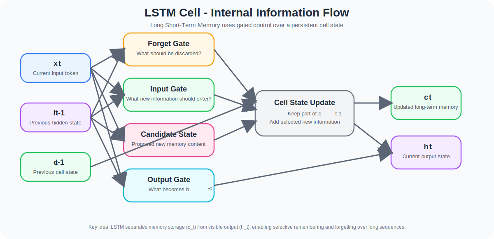
  <br>
  <em>LSTM internal information flow.</em>
</p>

This diagram highlights why LSTM is more expressive than a simple recurrent unit: it separates long-term memory ($c_t$) from visible output ($h_t$) and uses gates to control what is forgotten, updated, and exposed.


### Core Components of an LSTM Cell

At timestep $t$, the LSTM receives:

- the current input vector: $x_t$
- the previous hidden state: $h_{t-1}$
- the previous cell state: $c_{t-1}$

The hidden state $h_t$ is the **visible output** of the cell, while the cell state $c_t$ is the **long-term memory track** that carries information forward through time.

This distinction is one of the main reasons LSTMs are so effective.

### Main Equations

$$
f_t = \sigma\left(W_f [h_{t-1}, x_t] + b_f\right)
$$

$$
i_t = \sigma\left(W_i [h_{t-1}, x_t] + b_i\right)
$$

$$
\tilde{c}_t = \tanh\left(W_c [h_{t-1}, x_t] + b_c\right)
$$

$$
c_t = f_t \odot c_{t-1} + i_t \odot \tilde{c}_t
$$

$$
o_t = \sigma\left(W_o [h_{t-1}, x_t] + b_o\right)
$$

$$
h_t = o_t \odot \tanh(c_t)
$$

Where:

- $\sigma(\cdot)$ is the **sigmoid function**
- $\tanh(\cdot)$ is the **hyperbolic tangent**
- $\odot$ denotes **element-wise multiplication**
- $[h_{t-1}, x_t]$ denotes **concatenation** of the previous hidden state and the current input

### 1. Forget Gate

The forget gate is defined as:

$$
f_t = \sigma\left(W_f [h_{t-1}, x_t] + b_f\right)
$$

Its role is to decide how much of the previous memory $c_{t-1}$ should be preserved.

Because sigmoid values lie in the interval $[0,1]$:

- if a component of $f_t$ is close to **1**, that part of memory is mostly retained
- if a component is close to **0**, that part of memory is mostly erased

#### Intuition

The forget gate answers:

> “How much of the old memory is still relevant?”

This is essential in language because not every earlier word remains important later in the sentence.

### 2. Input Gate

The input gate is defined as:

$$
i_t = \sigma\left(W_i [h_{t-1}, x_t] + b_i\right)
$$

Its job is to decide how much new information should be written into memory.

#### Intuition

The input gate answers:

> “How much of the current input should be stored in long-term memory?”

If the gate is close to 0, the model blocks the update.  
If it is close to 1, the model allows the new information to be written strongly.

### 3. Candidate Cell State

The candidate memory content is:

$$
\tilde{c}_t = \tanh\left(W_c [h_{t-1}, x_t] + b_c\right)
$$

This is the **proposed new content** that could be stored in memory.

It is not memory by itself.  
It is only a **candidate**, and the input gate decides how much of it is actually written into the cell state.

Because $\tanh$ outputs values in $[-1,1]$, the candidate update is bounded and stable.

### 4. Cell State Update

The true memory update happens here:

$$
c_t = f_t \odot c_{t-1} + i_t \odot \tilde{c}_t
$$

This equation is the heart of the LSTM.

The new cell state is built from two parts:

#### Retained old memory
$$
f_t \odot c_{t-1}
$$

#### Selected new memory
$$
i_t \odot \tilde{c}_t
$$

So the LSTM does **not** completely overwrite memory at every step.  
Instead, it performs a **controlled additive update**:

- keep part of the old memory
- add selected new information

#### Why this is important

This additive structure is one of the main reasons LSTMs are better than vanilla RNNs at handling long-range dependencies.

In a simple RNN, repeated multiplication through time tends to shrink useful signals.  
In an LSTM, the cell-state pathway provides a more stable route for memory propagation.

When the forget gate remains close to 1:

$$
f_t \approx 1
$$

then:

$$
c_t \approx c_{t-1}
$$

This means information can pass through many timesteps without being destroyed.

That is one of the core mathematical reasons LSTMs mitigate the **vanishing-gradient problem**.

### 5. Output Gate

The output gate is:

$$
o_t = \sigma\left(W_o [h_{t-1}, x_t] + b_o\right)
$$

Its purpose is to decide how much of the updated internal memory should become the visible hidden state.

#### Intuition

The output gate answers:

> “What part of the internal memory should the rest of the network see right now?”

This is why LSTM is more expressive than a plain recurrent unit:
it separates **stored memory** from **visible output**.

### 6. Hidden State

The final hidden state is:

$$
h_t = o_t \odot \tanh(c_t)
$$

The memory $c_t$ is first passed through $\tanh$, then filtered by the output gate.

So:

- $c_t$ = internal long-term memory
- $h_t$ = visible representation exposed to the next layer / next timestep

This separation gives the LSTM finer control over what is remembered versus what is shown.

### Why LSTM Works Well in NLP

LSTMs are particularly useful when:

- meaning depends on earlier context
- negation changes later interpretation
- long-range dependencies matter
- sentiment is reversed later in the sentence
- the sequence contains clause-level transitions

Examples:

- “I thought it would be awful, but it was actually brilliant.”
- “The movie starts slowly, yet the ending completely changes the experience.”

A simple embedding average may miss these transitions.  
An LSTM has a mechanism to preserve, update, and reinterpret memory over time.

### Cost of LSTMs

The power of LSTMs comes with tradeoffs:

- more parameters than simple recurrent layers
- more compute than simpler sequence encoders
- slower training than GRUs or Conv1D models
- more sensitivity to architecture depth and sequence length

So LSTM is not “free” expressivity.  
It is a deliberate modeling choice that trades efficiency for richer memory control.

---

## 🧠 GRU in Detail

### What is a GRU?

**GRU** stands for **Gated Recurrent Unit**.

It is a simplified gated recurrent architecture that keeps the core idea of controlled memory flow, but uses fewer gates and no separate cell state.

Where LSTM uses:

- A hidden state $h_t$
- A cell state $c_t$

GRU uses only:

- A hidden state $h_t$

That makes the GRU more compact and often faster to train.

### Architecture

<p align="center">
  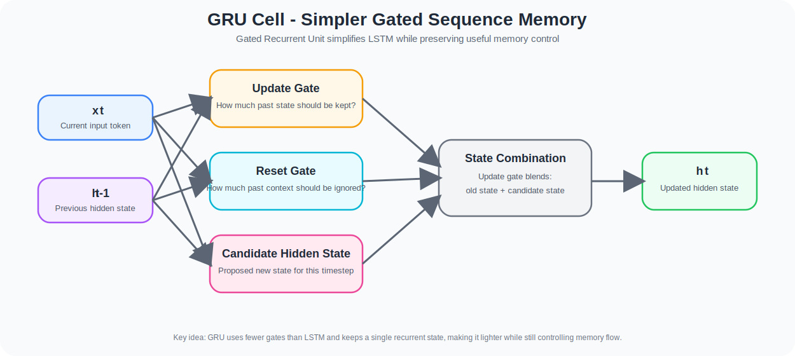
  <br>
  <em>GRU internal information flow.</em>
</p>

This diagram shows why GRU is often considered a lighter alternative to LSTM: it uses fewer gates, keeps a simpler recurrent state, and still preserves controlled memory flow.

---

### Main Equations

$$
z_t = \sigma\left(W_z [h_{t-1}, x_t] + b_z\right)
$$

$$
r_t = \sigma\left(W_r [h_{t-1}, x_t] + b_r\right)
$$

$$
\tilde{h}_t = \tanh\left(W_h [r_t \odot h_{t-1}, x_t] + b_h\right)
$$

$$
h_t = (1 - z_t) \odot h_{t-1} + z_t \odot \tilde{h}_t
$$

Where:

- $z_t$ = **update gate**
- $r_t$ = **reset gate**
- $\tilde{h}_t$ = **candidate hidden state**
- $h_t$ = **new hidden state**

### 1. Update Gate

The update gate is:

$$
z_t = \sigma\left(W_z [h_{t-1}, x_t] + b_z\right)
$$

It controls how much of the previous hidden state should be kept versus replaced.

Because sigmoid outputs values in $[0,1]$:

- if $z_t$ is close to **0**, the model keeps more of the old state
- if $z_t$ is close to **1**, the model writes more of the new candidate state

#### Intuition

The update gate answers:

> “Should I preserve the old representation, or replace it with a new one?”

This gate effectively combines the roles of:
- memory retention
- memory update

That is one reason the GRU is simpler than the LSTM.

### 2. Reset Gate

The reset gate is:

$$
r_t = \sigma\left(W_r [h_{t-1}, x_t] + b_r\right)
$$

Its role is to control how strongly the previous hidden state should influence the candidate computation.

In the candidate equation:

$$
r_t \odot h_{t-1}
$$

the reset gate can suppress older context before the new candidate is formed.

#### Intuition

The reset gate answers:

> “How much of the past should matter when I compute the new candidate state?”

This is useful when the model needs to ignore stale context and focus on the current local signal.

### 3. Candidate Hidden State

The candidate hidden state is:

$$
\tilde{h}_t = \tanh\left(W_h [r_t \odot h_{t-1}, x_t] + b_h\right)
$$

This is the **proposed new state** for the current timestep.

It depends on:
- the current input
- a reset-filtered version of the previous hidden state

So the reset gate determines how much prior information participates in candidate formation.

### 4. Hidden State Update

The final update rule is:

$$
h_t = (1 - z_t) \odot h_{t-1} + z_t \odot \tilde{h}_t
$$

This is the core GRU equation.

The new hidden state is a weighted interpolation between:

- the old hidden state
- the candidate hidden state

This means the model can smoothly preserve or overwrite information rather than replacing memory abruptly.

#### Why this matters

If the update gate stays small:

$$
z_t \approx 0
$$

then:

$$
h_t \approx h_{t-1}
$$

So information can persist across many timesteps.

That gives the GRU a stable path for memory retention and helps mitigate vanishing gradients, just like LSTM — but with a simpler structure.

### Why GRU Is Simpler Than LSTM

There are two main simplifications:

#### 1. No separate cell state
LSTM has:
- $h_t$
- $c_t$

GRU has only:
- $h_t$

#### 2. Fewer gates
LSTM uses:
- Forget gate
- Input gate
- Output gate
- Candidate memory

GRU uses:
- Update gate
- Reset gate
- Candidate hidden state

So GRU generally has fewer parameters and less computational overhead.

### Why GRUs Are Appealing

Compared with LSTMs, GRUs often:

- Train faster
- Use fewer parameters
- Are easier to optimize
- Still preserve gated memory behavior
- Perform competitively on many text tasks

This makes GRUs especially attractive when:
- Compute efficiency matters
- Datasets are moderate in size
- You want recurrent modeling without the full cost of LSTM

### GRU vs LSTM

#### LSTM
- More structured memory system
- Explicit cell state + hidden state
- More gates
- Heavier but highly expressive

#### GRU
- Simpler state transition
- Fewer gates
- No separate cell state
- Lighter and often faster

So the choice between LSTM and GRU is not about “which one is universally better,” but rather:

> Which inductive bias and computational tradeoff best matches the task?


### Why GRU Matters in NLP

GRUs are useful when you want:

- Recurrent context modeling
- Fewer parameters than LSTM
- Efficient training
- Strong performance on sentiment or sequence classification tasks

They are especially valuable as a comparison architecture because they show how much recurrent modeling can be achieved with a simpler gating scheme.

---

## 🧱 Single Layer vs Multi Layer

### Single-Layer Recurrent Models

A single recurrent layer is often the cleanest baseline because it:
- Is easier to interpret
- Is easier to optimize
- Has fewer parameters
- Already captures temporal dependency

This is why the module starts with a single recurrent architecture before adding depth.

### Multi-Layer / Stacked Recurrent Models

A stacked recurrent model adds a second recurrent layer on top of the first.

This only works if the lower recurrent layer outputs the full sequence, which is why:

```python
Bidirectional(LSTM(64, return_sequences=True))
```

is required before another recurrent layer can be added.

### Architecture Comparison

<p align="center">
  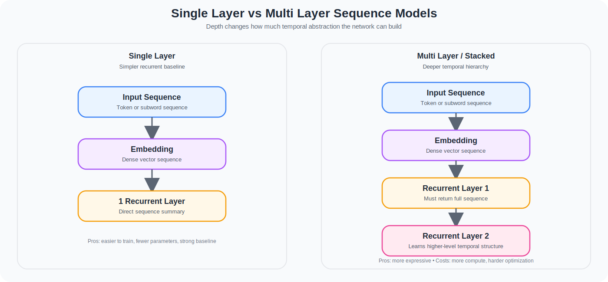
  <br>
  <em>Single-layer vs multi-layer recurrent architecture comparison.</em>
</p>

This comparison shows that stacking recurrent layers is not just “adding depth” — it changes the model’s ability to build hierarchical temporal representations, at the cost of extra computation and optimization difficulty.

### Why Stack Recurrent Layers?

A useful mental model:

- Lower recurrent layers learn more local or lower-level temporal structure
- Upper recurrent layers learn more abstract sequence patterns

This gives the model more representational hierarchy, but also increases:

- Training cost
- Optimization difficulty
- Risk of overfitting

Stacking is therefore not just “more layers,” but a deliberate choice to learn **deeper temporal abstractions**.

---

## ↔️ Unidirectional vs Bidirectional

### Unidirectional Models

A standard recurrent model processes the sentence in one direction:
- Left to right

This means the representation at timestep *t* only knows about earlier tokens.

### Bidirectional Models

A **Bidirectional** recurrent model runs:
- One recurrent pass forward
- One recurrent pass backward

The outputs are then combined, typically by concatenation.

### Architecture Comparison

<p align="center">
  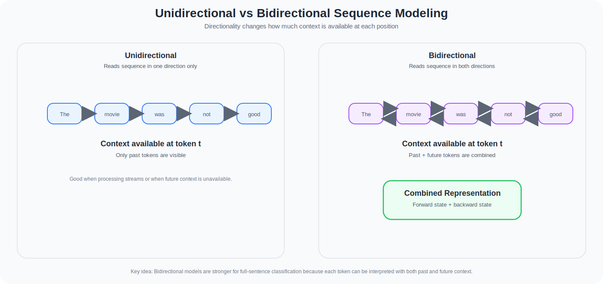
  <br>
  <em>Unidirectional vs bidirectional sequence modeling comparison.</em>
</p>

This comparison shows why bidirectional sequence models are powerful for classification: each token can be interpreted with both past and future context when the full sentence is available.

### Why This Matters

In text classification, the full sequence is already available at inference time.  
That means future context is often useful.

Example:

```text
“That was just great...”
```

The meaning may depend heavily on what comes next.

Bidirectional models are therefore powerful when:
- The full sentence is available
- Classification depends on global context
- Both earlier and later tokens influence interpretation

### Tradeoff

Benefits:
- Richer contextual representation
- Better full-sentence encoding
- Stronger performance on many classification tasks

Costs:
- More compute
- More parameters
- Not ideal for streaming settings where future tokens are unavailable

---

## 📡 Why Conv1D Appears in an NLP Module

At first glance, convolution may look like an image-specific technique.  
But `Conv1D` is extremely useful for text.

### Intuition

A 1D convolution kernel slides across the token sequence and detects local patterns.

If the kernel size is `5`, the layer effectively learns patterns over 5-token windows.

That makes it similar to a learnable n-gram detector.

### What Conv1D Captures Well

- Short phrases
- Local sentiment triggers
- Local sarcasm markers
- Repeated phrase structures
- Compact feature motifs

### Pooling in Conv1D Models

Pooling layers such as:
- `GlobalAveragePooling1D()`
- `GlobalMaxPooling1D()`
- `MaxPooling1D()`

reduce the time dimension and force the model to keep the most useful local features.

### Conv1D vs Recurrent Models

#### Conv1D
- Local pattern detector
- Highly parallelizable
- Efficient
- Strong for phrase-level signals

#### LSTM / GRU
- Explicit temporal state propagation
- Designed to maintain sequential memory
- Stronger for longer-range dependencies

This is why Conv1D and recurrent models are not redundant.  
They express different inductive biases.

---

## ⚙️ Technical Implementation

### 1️⃣ IMDB Subwords8K with Single-Layer Bidirectional LSTM

#### Architecture

<p align="center">
  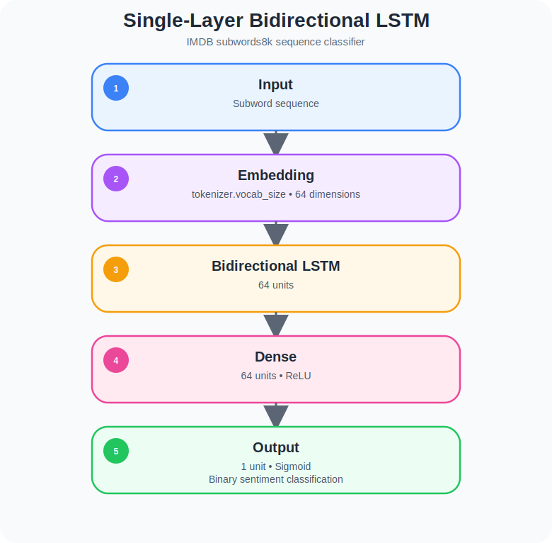
  <br>
  <em>Single-layer Bidirectional LSTM architecture.</em>
</p>

#### Technical interpretation
This is the first true sequence model in the module.  
The embedding layer converts tokens into dense vectors, and the Bidirectional LSTM then scans the full sequence from both directions. The resulting representation is not just a summary of which subwords occurred, but a context-conditioned encoding of how they interacted across the sequence.

#### Why this matters
- Establishes the recurrent baseline
- Introduces memory-aware sequence modeling
- Introduces bidirectional context on subword-encoded text

---

### 2️⃣ IMDB Subwords8K with Multi-Layer Bidirectional LSTM

#### Architecture

<p align="center">
  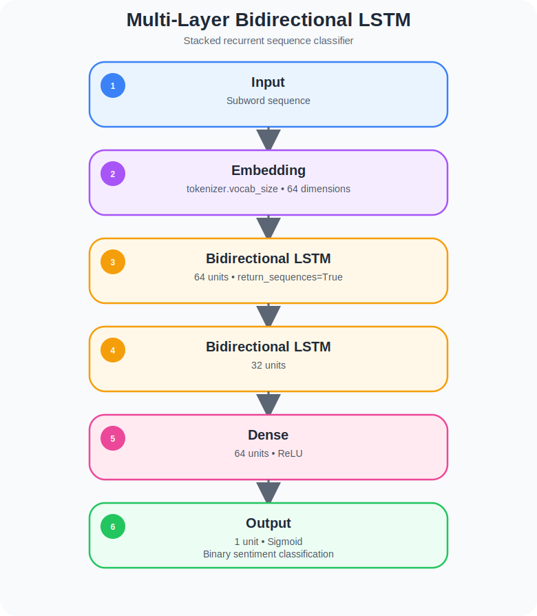
  <br>
  <em>Multi-layer Bidirectional LSTM architecture.</em>
</p>

#### Technical interpretation
The first recurrent layer outputs a sequence of hidden states for every timestep.  
That is necessary because the second recurrent layer needs the full temporal signal, not just the final summary vector. This stacked design allows the model to build a deeper hierarchy of sequence abstractions.

#### Why this matters
- Demonstrates recurrent depth
- Shows why `return_sequences=True` is required in recurrent stacking
- Compares shallow vs deeper temporal modeling

---

### 3️⃣ IMDB Subwords8K with 1D Convolution

#### Architecture

<p align="center">
  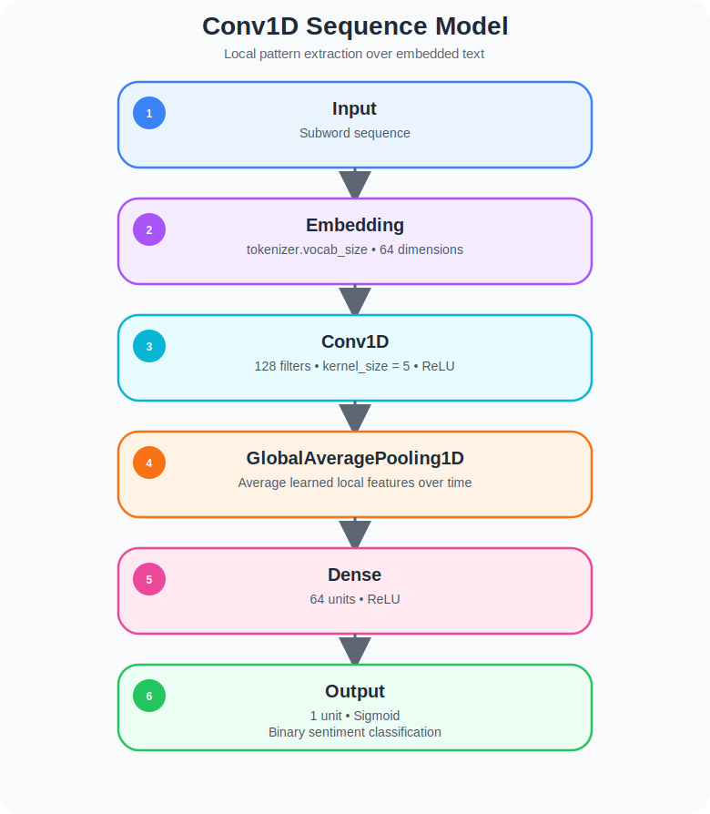
  <br>
  <em>Conv1D sequence model architecture.</em>
</p>

#### Technical interpretation
This model treats the embedded sequence as a 1D signal and slides 128 learnable filters across it. Each filter learns to detect a useful local pattern over a 5-token region. The pooling layer then compresses the time dimension into a global summary.

#### Why this matters
- Contrasts recurrent memory with local pattern extraction
- Shows that strong text classifiers do not always need explicit recurrence
- Introduces a faster and often simpler alternative to LSTM-style models

---

### 4️⃣ Sarcasm with Bidirectional LSTM

#### Architecture

<p align="center">
  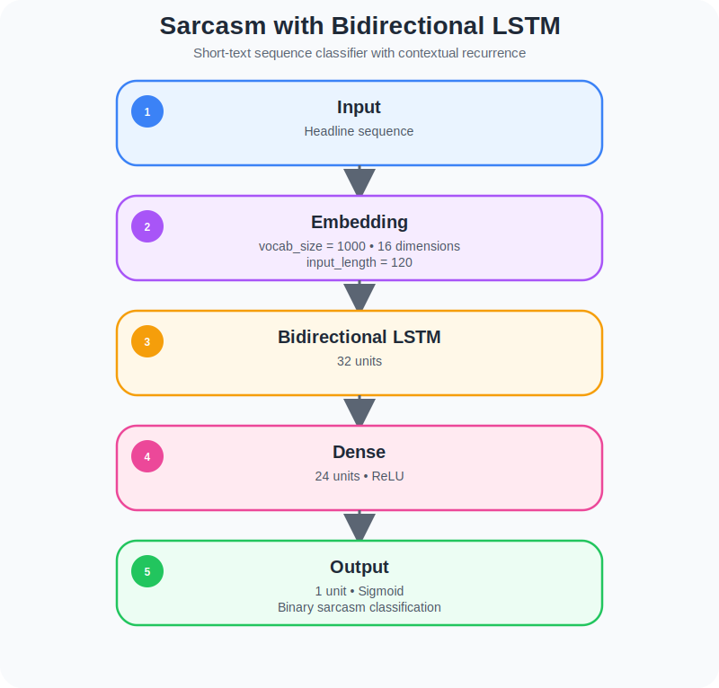
  <br>
  <em>Sarcasm with Bidirectional LSTM architecture.</em>
</p>

#### Technical interpretation
Even though sarcasm headlines are short, the wording order still matters. The bidirectional recurrent encoder captures both the buildup of the phrase and the later cue that may flip the meaning.

#### Why this matters
- Shows that sequence context matters even in short texts
- Provides a clean recurrent baseline for sarcasm detection
- Is ideal for comparison against the convolutional version

---

### 5️⃣ Sarcasm with 1D Convolution

#### Architecture

<p align="center">
  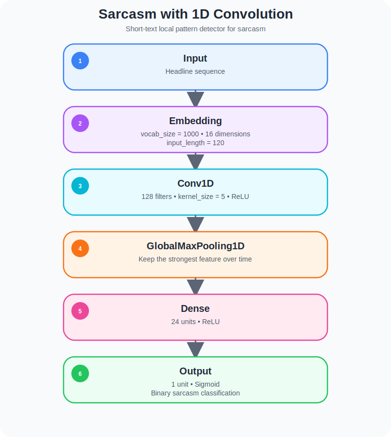
  <br>
  <em>Sarcasm with 1D Convolution architecture.</em>
</p>

#### Technical interpretation
This model assumes that the most important sarcasm cue may be a strong local pattern rather than a long memory chain. `GlobalMaxPooling1D()` selects the strongest detected feature over the full sequence, which is often useful when a single phrase is highly informative.

#### Why this matters
- Emphasizes local feature detection
- Introduces max-based global selection over time
- Highlights the architectural contrast between context memory and phrase-trigger detection

---

### 6️⃣ IMDB Reviews with Bidirectional GRU

#### Architecture

<p align="center">
  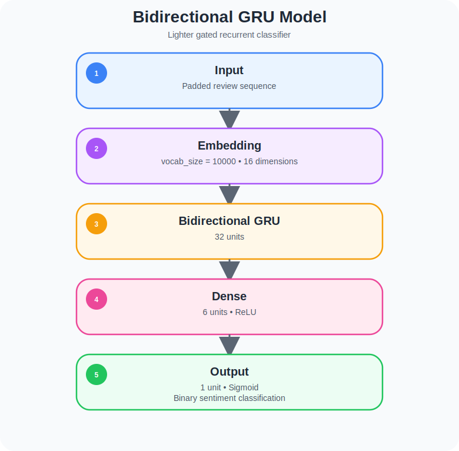
  <br>
  <em>Bidirectional GRU architecture.</em>
</p>

#### Technical interpretation
The GRU version keeps the core recurrent logic but reduces recurrent complexity relative to LSTM. It is a valuable comparison because it tests whether simpler gating can preserve most of the useful sequence behavior with lower parameter overhead.

#### Why this matters
- Introduces a lighter recurrent alternative
- Enables cell-type comparison
- Reinforces that recurrent architecture choice is a modeling decision, not a default setting

---

### 7️⃣ Assignment: GloVe + Conv1D + MaxPool + LSTM Hybrid

#### Architecture

<p align="center">
  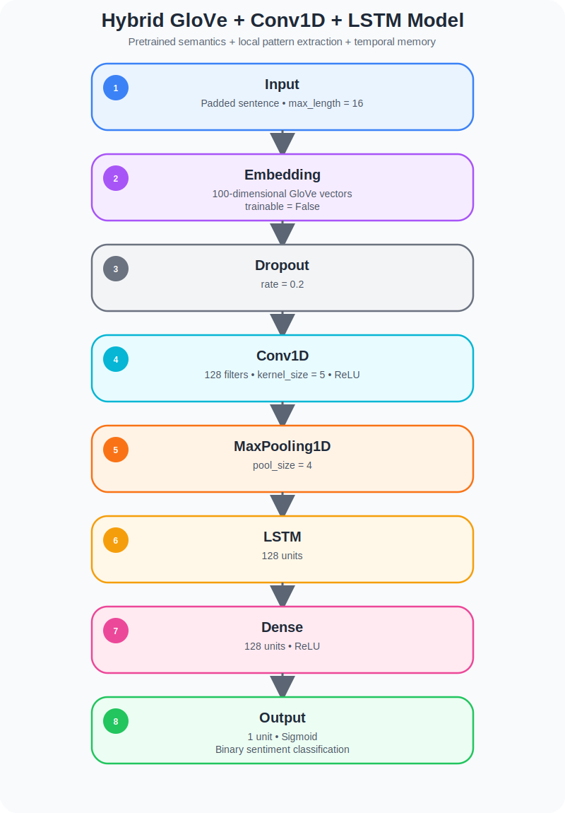
  <br>
  <em>Hybrid GloVe + Conv1D + LSTM assignment architecture.</em>
</p>

#### Technical interpretation
This is the most sophisticated architecture in the module because it is hybrid in three different ways:

1. **External semantic prior**
   - The embedding layer is initialized from pretrained GloVe vectors.
   - This injects semantic structure learned from a large external corpus.

2. **Local pattern extraction**
   - `Conv1D(128, 5)` learns phrase-level detectors before recurrence.

3. **Temporal summarization**
   - The downstream `LSTM(128)` processes the filtered sequence representation and builds a memory-aware summary.

The embedding layer is frozen (`trainable=False`), which means the model uses GloVe as fixed semantic input rather than adapting it during task training. That design can stabilize learning when pretrained semantics are valuable and the downstream model is doing most of the task-specific adaptation.

#### Why this matters
This architecture demonstrates mature architectural reasoning:
- Use pretrained knowledge for semantics
- Use convolution for local phrase patterns
- Use recurrence for temporal integration
- Use dropout for regularization

This is one of the strongest portfolio artifacts in the course because it shows not just a standard layer stack, but a structured design strategy.

---

## 🧠 What This Module Builds Toward

This module prepares the conceptual foundation for:

- More advanced sequence modeling
- Sequence-to-sequence reasoning
- Many-to-many architectures
- Text generation
- Encoder-decoder structures
- Eventually, understanding why transformers replaced many recurrent pipelines

In other words:

> Module 3 is where NLP becomes explicitly temporal.

---

## 📊 Results and Interpretation

This module is less about one single “best” architecture and more about understanding **why different architecture families behave differently**.

The most important outputs are:

- Training and validation curves
- Recurrent vs convolutional inductive bias
- Differences between shallow and deep recurrence
- Effects of bidirectionality
- Effects of pretrained semantic initialization
- Local-pattern vs long-memory tradeoffs

### What to look for

- Whether Bidirectional recurrent models capture richer whole-sentence context
- Whether Conv1D reaches strong performance with simpler local detectors
- Whether stacked recurrent layers justify their added complexity
- Whether GRU offers a favorable efficiency / expressivity tradeoff
- Whether the hybrid GloVe architecture benefits from combining multiple modeling biases

The core value of this module is **architectural comparison with technical reasoning**, not merely reporting one final metric.

---

## 🔑 Key Concepts

- Sequence modeling
- Temporal dependency
- Context-sensitive classification
- LSTM gating
- GRU gating
- Bidirectional context fusion
- Recurrent depth
- Conv1D for text
- Pooling over time
- Pretrained embeddings
- Hybrid sequence architectures

---

## 💡 What I Learned

- Embeddings solve token representation, but not full sequence understanding
- LSTMs preserve information through gated memory rather than simple recurrence
- GRUs simplify the gating mechanism while often remaining competitive
- Stacked recurrent layers learn deeper temporal abstractions but are harder to optimize
- Bidirectionality is powerful when full-sequence context is available
- Conv1D is a legitimate NLP architecture because language contains strong local patterns
- Pretrained GloVe embeddings provide semantic priors that can be combined with downstream sequence learners

Most importantly:

> Sequence models are not just “more layers after embeddings” — they change the kind of linguistic structure the network is able to represent.

---

## 📓 Notebooks & Exercises

### Lesson 1a
- IMDB subwords8k
- Single-layer Bidirectional LSTM
- Recurrent sequence baseline

### Lesson 1b
- IMDB subwords8k
- Stacked Bidirectional LSTM
- Depth comparison in recurrent modeling

### Lesson 1c
- IMDB subwords8k
- Conv1D + pooling
- Local sequence-pattern modeling

### Lesson 2
- Sarcasm headlines
- Bidirectional LSTM
- Sequence modeling on short text

### Lesson 2c
- Sarcasm headlines
- Conv1D + GlobalMaxPooling1D
- Convolutional comparison on the same task

### Lesson 2d
- IMDB reviews
- Bidirectional GRU
- Optional comparison with LSTM / Conv1D variants

### Assignment
- Large cleaned sentiment dataset
- Pretrained GloVe vectors
- Hybrid Conv1D + MaxPool + LSTM classifier
- Strongest architecture blend in the module

---

## 📘 Files in This Module

<pre>
📁 Module3_Sequence_models
├── 📓 Course_3_Week_3_Lesson_1a_IMDB Subwords 8K with Single Layer LSTM.ipynb
├── 📓 Course_3_Week_3_Lesson_1b_IMDB Subwords 8K with Multi Layer LSTM.ipynb
├── 📓 Course_3_Week_3_Lesson_1c_IMDB Subwords 8K with 1D Convolutional Layer.ipynb
├── 📓 Course_3_Week_3_Lesson_2_Sarcasm with Bidirectional LSTM.ipynb
├── 📓 Course_3_Week_3_Lesson_2c_Sarcasm with 1D Convolutional Layer.ipynb
├── 📓 Course_3_Week_3_Lesson_2d_IMDB Reviews with GRU (and optional LSTM and Conv1D).ipynb
├── 📓 Activity_C3_W3_Assignment.ipynb
├── 📁 architectures
│   ├── 🏗️ gru_explained.svg
│   ├── 🏗️ lstm_explained.svg
│   ├── 🏗️ module3_bidirectional_gru.svg
│   ├── 🏗️ module3_conv1d_sequence_model.svg
│   ├── 🏗️ module3_hybrid_glove_conv_lstm.svg
│   ├── 🏗️ module3_multi_layer_bilstm.svg
│   ├── 🏗️ module3_single_layer_bilstm.svg
│   ├── 🏗️module3_sarcasm_conv1d.svg
│   ├── 🏗️module3_sarcasm_bidirectional_lstm.svg
│   ├── 🏗️ single_vs_multi_layer.svg
|   └── 🏗️ unidirectional_vs_bidirectional.svg
├── 📄 requirements.txt
└── 📘 README.md
</pre>

**Legend**

<pre>
📁 Folder 
📓 Jupyter Notebook 
🏗️ Model Architecture / Diagram (.svg) 
📊 Results / Plots (.png) 
🗜️ Compressed Dataset 
📄 Configuration File 
📘 Project Documentation
</pre>


---

## 🛑 Limitations

- No separate final solved assignment notebook was available beyond the uploaded notebook
- The module does not yet cover transformer architectures
- Recurrent models are more sequential and computationally expensive than simpler encoders
- Some exact metrics and curves may vary depending on environment/runtime
- The README focuses on architectural analysis rather than a benchmark-style final score report

---

## 📚 Further Reading

- [TensorFlow LSTM Layer Documentation](https://www.tensorflow.org/api_docs/python/tf/keras/layers/LSTM)
- [TensorFlow GRU Layer Documentation](https://www.tensorflow.org/api_docs/python/tf/keras/layers/GRU)
- [TensorFlow Bidirectional Wrapper](https://www.tensorflow.org/api_docs/python/tf/keras/layers/Bidirectional)
- [TensorFlow Conv1D Layer Documentation](https://www.tensorflow.org/api_docs/python/tf/keras/layers/Conv1D)
- [TensorFlow Text and Sequence Tutorials](https://www.tensorflow.org/text)
- [Understanding LSTM Networks](https://colah.github.io/posts/2015-08-Understanding-LSTMs/)
- [GloVe Project Page](https://nlp.stanford.edu/projects/glove/)

