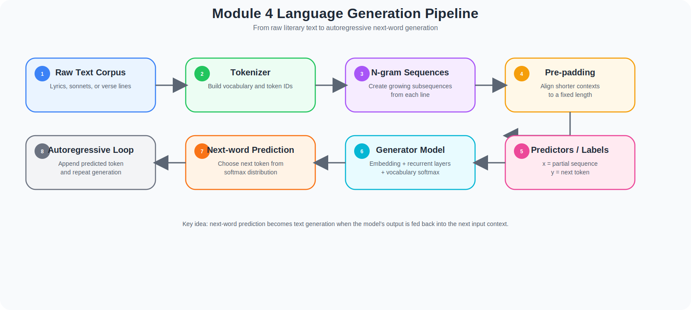
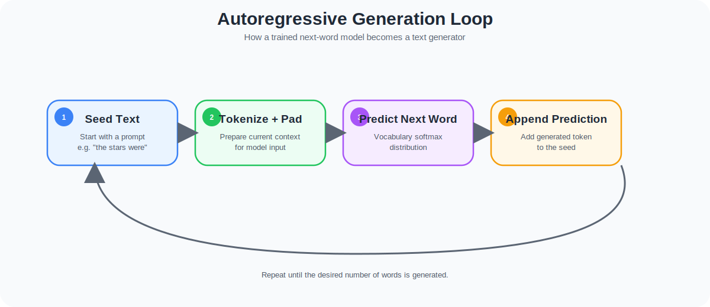
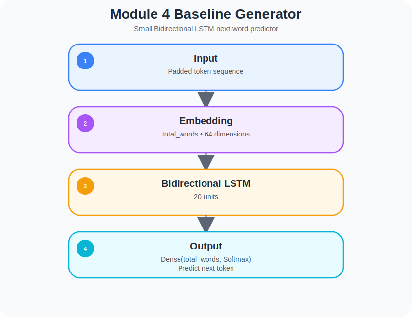
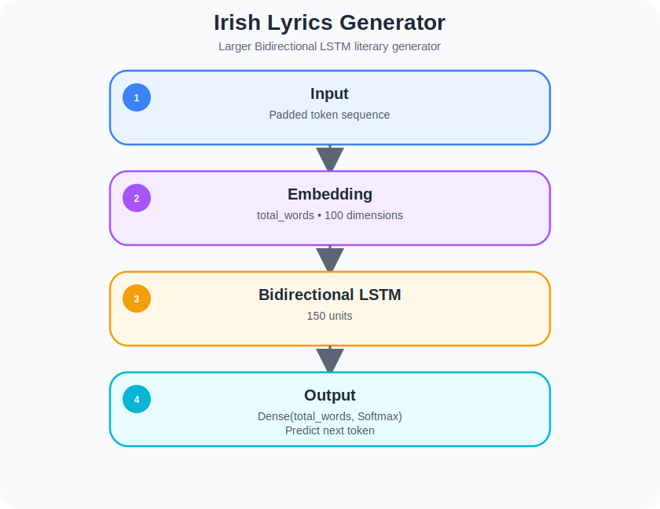
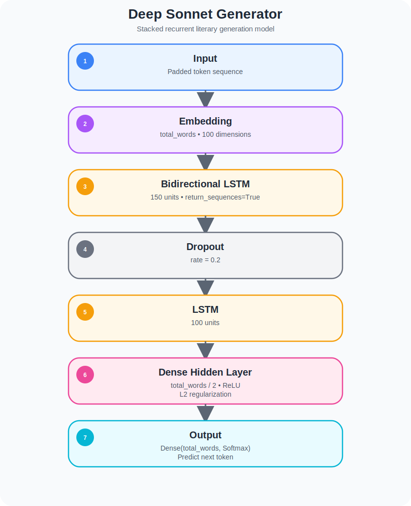

# Module 4 - Sequence Models and Literature

> **From Sequence Classification to Language Generation**: Building next-word prediction models with TensorFlow, Bidirectional LSTMs, stacked recurrent architectures, and literary text generation pipelines.

[](https://www.tensorflow.org/) [](https://keras.io/) [](https://www.python.org/) [](#)

---

## Table of Contents

1. [Overview](#-overview)
2. [Learning Objectives](#-learning-objectives)
3. [Why This Project Matters](#-why-this-project-matters)
4. [Who This Module Is For](#-who-this-module-is-for)
5. [Skills Demonstrated](#️-skills-demonstrated)
6. [Common Mistakes Explored in This Module](#️-common-mistakes-explored-in-this-module)
7. [How to Run](#️-how-to-run)
8. [Reproducibility Note](#-reproducibility-note)
9. [Problem Statement](#-problem-statement)
10. [Datasets](#-datasets)
11. [Deep Dive: What Changes When the Goal Is Generation](#-deep-dive-what-changes-when-the-goal-is-generation)
12. [Language Modeling in Detail](#-language-modeling-in-detail)
13. [Why Next-Word Prediction Works](#-why-next-word-prediction-works)
14. [Why Padding and N-gram Sequences Matter](#-why-padding-and-n-gram-sequences-matter)
15. [Why Softmax Over the Vocabulary Matters](#-why-softmax-over-the-vocabulary-matters)
16. [Technical Implementation](#️-technical-implementation)
17. [What This Module Builds Toward](#-what-this-module-builds-toward)
18. [Results and Interpretation](#-results-and-interpretation)
19. [Key Concepts](#-key-concepts)
20. [What I Learned](#-what-i-learned)
21. [Notebooks & Exercises](#-notebooks--exercises)
22. [Files in This Module](#-files-in-this-module)
23. [Limitations](#-limitations)
24. [Further Reading](#-further-reading)

---

## 🧭 Overview

In Module 3, the focus was on **sequence understanding**:

- Sentiment classification
- Sarcasm detection
- Recurrent memory
- Bidirectionality
- Local pattern extraction with convolution

But classification is still a discriminative task.

In Module 4, the objective changes in a fundamental way:

> The model is no longer asked to classify a sequence — it is asked to continue one.

That means the neural network must learn a distribution over possible next words and generate text autoregressively, one token at a time.

This module introduces the foundations of **neural language modeling** using TensorFlow and Keras, including:

- Next-word prediction
- N-gram sequence construction
- Vocabulary-wide softmax prediction
- Sequence padding for generation models
- Bidirectional LSTM text generators
- Stacked recurrent generators with dropout and regularization
- Literary and lyric corpora such as Irish lyrics and sonnets

This is the point in the course where sequence models stop being only **interpreters of text** and start becoming **producers of text**.

---

## 🖼️ Generation Pipeline at a Glance

<p align="center">
  
  <br>
  <em>Module 4 language generation pipeline.</em>
</p>

---

## 🎯 Learning Objectives

By the end of this module, you will understand how to:

- Build next-word prediction models for text generation
- Convert raw text corpora into n-gram training sequences
- Use tokenization and pre-padding for autoregressive generation
- Train vocabulary-level softmax generators
- Use Bidirectional LSTM models for literary sequence modeling
- Compare simple and deeper recurrent generators
- Generate new text from a seed phrase using iterative prediction
- Understand the difference between classification and language modeling
- Reason about the benefits and limitations of small-scale neural text generation

---

## 💼 Why This Project Matters

Module 4 is important because it introduces a new category of NLP problem:

> Not “what label should this text receive?” but “what token should come next?”

That shift matters because next-token prediction is one of the conceptual foundations behind modern generative language models.

Even though the architectures in this module are much smaller than modern large language models, the core idea is the same:

- Learn patterns in token sequences
- Estimate the probability of the next token
- Use that prediction recursively to generate text

This module demonstrates practical experience with:

- Sequence generation pipelines
- Autoregressive inference loops
- Vocabulary-level prediction
- Literary language modeling
- Recurrent generation architectures
- Deeper recurrent decoders with regularization

This module is especially strong because it shows that the work goes beyond classification and into **actual text generation**.

---

## 👥 Who This Module Is For

This module is designed for:

- Developers moving from sequence classification into text generation
- Data Scientists who want to understand language modeling fundamentals
- Students learning how next-word prediction works before modern transformers
- Practitioners interested in lyric or literary text generation
- Anyone building an NLP portfolio with both classification and generation projects

If Module 3 answered:

> “How do we model meaning across a sequence?”

Module 4 answers:

> “How do we generate the next piece of that sequence?”

---

## 🛠️ Skills Demonstrated

### 1️⃣ Language Modeling
- Built models that predict the next word in a sequence
- Used full-vocabulary `softmax` outputs instead of binary or multiclass labels
- Framed text generation as supervised sequence prediction

### 2️⃣ N-gram Sequence Construction
- Transformed each line of text into multiple training examples
- Built progressively growing subsequences from each line
- Created predictor/label pairs from language itself

### 3️⃣ Sequence Padding for Generation
- Used `pad_sequences(..., padding='pre')`
- Aligned variable-length contexts into a consistent input tensor
- Preserved right-aligned recent context for next-word prediction

### 4️⃣ Bidirectional LSTM Generation
- Built Bidirectional LSTM generators over lyrical corpora
- Used recurrent sequence encoding to support next-token prediction
- Generated multi-word continuations from seed text

### 5️⃣ Deeper Recurrent Generation
- Built stacked recurrent generators with:
  - Bidirectional LSTM
  - Dropout
  - Second LSTM layer
  - Dense hidden layer
  - Softmax vocabulary output

### 6️⃣ Regularization in Generation Models
- Applied dropout to reduce overfitting
- Applied L2 regularization on dense layers in the sonnet generator
- Improved model robustness on limited literary corpora

### 7️⃣ Autoregressive Inference
- Generated text iteratively:
  - Tokenize seed text
  - Pad sequence
  - Predict next token
  - Append token
  - Repeat

This is a crucial conceptual bridge toward larger generative NLP systems.

---

## ⚠️ Common Mistakes Explored in This Module

- **Treating Generation Like Classification**
  - A generator does not output a class label like “positive” or “negative”.
  - It outputs a probability distribution over the vocabulary.

- **Ignoring Sequence Construction**
  - Good generation depends heavily on how training sequences are built.
  - The n-gram construction process is part of the model design.

- **Using the Wrong Padding Direction**
  - In next-word prediction, pre-padding is often more natural because the most recent words should align near the end of the input window.

- **Forgetting That the Label Is the Final Token**
  - The predictor is the partial sequence.
  - The label is the next word to predict.

- **Confusing Better Grammar with True Understanding**
  - A small recurrent generator can produce plausible local text.
  - That does not mean it has deep semantic or world understanding.

- **Assuming More Epochs Automatically Mean Better Text**
  - Generation quality may improve, plateau, or degrade through overfitting.
  - Higher training accuracy does not always guarantee more natural generations.

- **Ignoring Corpus Size**
  - Small literary corpora can teach strong stylistic patterns.
  - They also limit diversity and factual consistency.

---

## ▶️ How to Run

This module consists of Jupyter notebooks that can be run locally or on Google Colab.

### Prerequisites

- Python 3.8 or higher
- pip
- Virtual environment support (recommended)
- TensorFlow 2.x
- NumPy
- Matplotlib

### 1. Clone the Repository

```bash
git clone https://github.com/victorperone/Natural_Language_Processing_in_Tensorflow.git
cd Natural_Language_Processing_in_Tensorflow/Module4_Sequence_Models_and_Literature
```

### 2. Create and Activate a Virtual Environment (Recommended)

**Linux / macOS**
```bash
python3 -m venv venv
source venv/bin/activate
```

**Windows**
```bash
python -m venv venv
venv\Scripts\activate
```

### 3. Install Dependencies

```bash
pip install -r requirements.txt
```

### 4. Launch Jupyter Notebook

```bash
jupyter notebook
```

or:

```bash
jupyter lab
```

### 5. Run on Google Colab

These notebooks are Colab-friendly, but several of them download text corpora during execution.

⚠️ **Note:** External text files such as Irish lyrics and sonnets are downloaded inside the notebooks, so internet access may be required when running them for the first time.

---

## 🧪 Reproducibility Note

This module trains generative sequence models, so exact outputs may vary due to:

- random initialization
- optimizer dynamics
- corpus ordering
- sequence padding
- vocabulary size
- TensorFlow version differences
- sampling behavior during text generation

The following should remain consistent:

- sequence construction logic
- model family
- generation pipeline
- predictor/label setup
- iterative seed-text continuation process

---

## ❓ Problem Statement

Previous modules asked models to understand text.

This module asks them to generate text.

That changes the task completely.

Instead of predicting a sentiment label or category, the model must learn:

- what sequences are likely
- what token tends to follow a context
- what stylistic patterns appear in a corpus
- how token probabilities evolve over time

The challenge in this module is:

> How do we train a neural network to continue a piece of text one token at a time?

The solution explored here is next-word prediction through sequence modeling:

- tokenize the corpus
- build n-gram subsequences
- pad them to a fixed length
- train the model to predict the final token
- repeat that prediction iteratively during generation

This is the fundamental language-modeling pattern behind text generation.

---

## 💾 Datasets

### 1️⃣ Small Irish Verse Example
Used in the first lab as a compact teaching example.

Why it matters:
- introduces next-word prediction on a small hand-crafted corpus
- makes the sequence construction process easy to inspect
- is ideal for understanding n-gram training examples before scaling up

### 2️⃣ Irish Lyrics Corpus
Used in the second lab for larger-scale next-word generation.

Why it matters:
- provides a richer vocabulary and stylistic structure
- supports training a stronger Bidirectional LSTM generator
- demonstrates lyric-style generation from seed text

### 3️⃣ Sonnets Corpus
Used in the exercise notebooks.

Why it matters:
- Introduces more literary language
- Supports deeper recurrent modeling
- Makes style transfer and poetic continuation more visible
- Motivates dropout and regularization in the generator

---

## 📉 Deep Dive: What Changes When the Goal Is Generation

In classification, the model compresses a sequence into a label.

In generation, the model must preserve enough information from the sequence to answer:

> what should come next?

That means the output space is much larger.

Instead of:
- 2 classes
- 5 classes
- 10 classes

the generator may predict over the **entire vocabulary**.

This transforms the task into a token-level probabilistic problem.

The model is effectively learning:

$$
P(w_t \,|\, w_1, w_2, ..., w_{t-1})
$$

That is, the probability of the next word given the previous words.

This is the central objective of language modeling.

---

## 🧠 Language Modeling in Detail

A **language model** learns to estimate the probability of the next token given the tokens that came before it.

In Module 4, this is the central shift:

- Previous modules focused on **understanding** sequences
- This module focuses on **continuing** sequences

A language model assigns probabilities to token sequences.

For a sentence:

```text
the moon was bright tonight
```

the model learns the probability of each token given its context:

- $P(\text{moon} \,|\, \text{the})$
- $P(\text{was} \,|\, \text{the moon})$
- $P(\text{bright} \,|\, \text{the moon was})$
- $P(\text{tonight} \,|\, \text{the moon was bright})$

During training in this module, those probabilities are approximated using supervised examples derived from the corpus.

The model sees many sequence fragments and learns which next tokens are most likely.


So instead of mapping a sentence to a label, the model now learns a conditional probability distribution:

$$
P(w_t \mid w_1, w_2, \dots, w_{t-1})
$$

That means:

> Given the previous words, what is the probability of the next word?

This is the core idea behind next-word prediction and the foundation of neural text generation.


### 1️⃣ From Classification to Generation

In a classification task, the model receives a sequence and predicts a final label:

$$
x \rightarrow y
$$

Examples:

- Review $\rightarrow$ positive / negative
- Headline $\rightarrow$ sarcastic / not sarcastic
- Article $\rightarrow$ topic label

In language modeling, the output is not a single fixed class like “positive.”

Instead, the model predicts a probability distribution over the **entire vocabulary**:

$$
x_{1:t-1} \rightarrow \hat{y}_t \in \mathbb{R}^{|V|}
$$

Where:

- $x_{1:t-1}$ is the input context
- $|V|$ is the vocabulary size
- $\hat{y}_t$ is the predicted probability distribution over all words in the vocabulary

So the task becomes:

> Choose the most likely next token from the vocabulary

That is why Module 4 uses a final softmax layer with vocabulary size output.


### 2️⃣ Chain Rule Interpretation of Language

A full sentence probability can be factorized using the chain rule:

$$
P(w_1, w_2, \dots, w_T)
=
\prod_{t=1}^{T} P(w_t \mid w_1, w_2, \dots, w_{t-1})
$$

This is one of the most important equations in language modeling.

It says that a sentence can be modeled by multiplying the conditional probability of each word given the words before it.

For example, the sentence:

```text
the moon was bright tonight
```

can be decomposed as:

$$
P(\text{the}, \text{moon}, \text{was}, \text{bright}, \text{tonight})
=
P(\text{the})
\cdot
P(\text{moon} \mid \text{the})
\cdot
P(\text{was} \mid \text{the moon})
\cdot
P(\text{bright} \mid \text{the moon was})
\cdot
P(\text{tonight} \mid \text{the moon was bright})
$$

The models in Module 4 do not estimate this full expression explicitly all at once.  
Instead, they learn the repeated next-token subproblem:

$$
P(w_t \mid w_1, \dots, w_{t-1})
$$

That is why next-word prediction is enough to build a text generator.

### 3️⃣ Turning Raw Text into Supervised Learning

The reason this module works is that raw text can be converted into many supervised examples.

Suppose a line is:

```text
i love deep learning
```

After tokenization, we might get:

```text
[4, 9, 15, 21]
```

From this one line, we can create multiple training examples:

- input: `i` → label: `love`
- input: `i love` → label: `deep`
- input: `i love deep` → label: `learning`

Mathematically, this means that one sequence

$$
(w_1, w_2, w_3, w_4)
$$

becomes the set of supervised pairs:

$$
(w_1) \rightarrow w_2
$$

$$
(w_1, w_2) \rightarrow w_3
$$

$$
(w_1, w_2, w_3) \rightarrow w_4
$$

This is exactly how language modeling turns unstructured text into structured training data.

### 4️⃣ Why N-gram Style Sequence Construction Matters

In Module 4, training examples are created by progressively extending each line.

If a tokenized line is:

$$
[t_1, t_2, t_3, t_4, t_5]
$$

then the generated subsequences are:

$$
[t_1, t_2]
$$

$$
[t_1, t_2, t_3]
$$

$$
[t_1, t_2, t_3, t_4]
$$

$$
[t_1, t_2, t_3, t_4, t_5]
$$

Then each padded sequence is split into:

- **predictors** = all tokens except the last
- **label** = the final token

So if one padded sequence is:

$$
[t_1, t_2, t_3, t_4]
$$

then:

$$
x = [t_1, t_2, t_3]
$$

$$
y = t_4
$$

This is the training setup behind all the generation models in the module.

### 5️⃣ Why Pre-padding Is Used

The module uses:

```python
pad_sequences(..., padding='pre')
```

This is important because next-word prediction usually depends most strongly on the **most recent context**.

Pre-padding keeps the right edge aligned.

Example:

Short sequence:

```text
[4, 9]
```

After pre-padding to length 5:

```text
[0, 0, 0, 4, 9]
```

This means the most recent tokens remain close to the end of the sequence, where the model expects them.

That is often more natural for autoregressive generation than post-padding.

### 6️⃣ Vocabulary Softmax and Probability Output

The model’s final dense layer has one neuron for each vocabulary item:

$$
\text{Dense}(|V|, \text{softmax})
$$

If the vocabulary contains 5,000 words, then the output layer has 5,000 units.

The softmax function converts raw scores (logits) into a probability distribution:

$$
P(w_i \mid x)
=
\frac{e^{z_i}}{\sum_{j=1}^{|V|} e^{z_j}}
$$

Where:

- $z_i$ is the logit for token $i$
- $|V|$ is the vocabulary size

This guarantees:

$$
\sum_{i=1}^{|V|} P(w_i \mid x) = 1
$$

So the model outputs a full probability distribution over the vocabulary.

This is very different from:

- Sigmoid for binary classification
- Low-dimensional softmax for a small set of class labels

Here, the classes are literally the words themselves.

### 7️⃣ Why Categorical Cross-Entropy Is Used

Because the label is a single correct next word from the vocabulary, the model is trained with categorical cross-entropy:

$$
\mathcal{L} = - \sum_{i=1}^{|V|} y_i \log(\hat{y}_i)
$$

Where:

- $y_i$ is the one-hot encoded target
- $\hat{y}_i$ is the predicted probability for token $i$

Since the target is one-hot encoded, this simplifies to:

$$
\mathcal{L} = - \log(\hat{y}_{\text{true}})
$$

This means the model is directly penalized when it assigns low probability to the correct next word.

So training is fundamentally about pushing the correct next token higher in the vocabulary distribution.

---

### 8️⃣ Why Recurrent Layers Help in Generation

The next token often depends on:

- The recent phrase
- The style of the line
- Longer-range rhythm or syntax
- Repeated thematic patterns in the corpus

That is why Bidirectional LSTM and stacked recurrent layers are useful in Module 4.

The recurrent network transforms the padded input sequence into a context-dependent hidden representation:

$$
h = f(x_1, x_2, \dots, x_{t-1})
$$

That hidden state is then projected into vocabulary space:

$$
\hat{y}_t = \text{softmax}(W h + b)
$$

So the recurrent stack learns a compressed internal representation of the current context, and the final dense layer turns that context into a next-word distribution.

### 9️⃣ Autoregressive Generation Loop

After training, the model becomes a generator by applying the same prediction process repeatedly.

<p align="center">
  
  <br>
  <em>Autoregressive generation loop.</em>
</p>

Given a seed phrase:

```text
the stars were bright
```

the model predicts:

$$
w_{t+1} = \arg\max P(w \mid \text{the stars were bright})
$$

Suppose it predicts:

```text
tonight
```

Then the sequence becomes:

```text
the stars were bright tonight
```

Now the model predicts again:

$$
w_{t+2} = \arg\max P(w \mid \text{the stars were bright tonight})
$$

This repeats iteratively.

So the generator works by using its own output as part of the next input.

This recursive process is the core of autoregressive generation.

### 🔟 Why Generated Text Can Look Good Locally but Weak Globally

A small recurrent language model often learns:

- Local grammar
- Phrase continuity
- Corpus-specific style
- Short-range word associations

But it may still struggle with:

- Long-range global coherence
- Factual consistency
- Narrative planning
- Deep semantic structure

That is why generated text may sound plausible word-by-word while still drifting semantically over longer continuations.

This is not a failure of the idea — it is a limitation of:
- Corpus size
- Architecture capacity
- Training scale
- Generation strategy

Understanding this limitation is part of truly understanding language modeling.

### 1️⃣1️⃣ Why Module 4 Matters Conceptually

Module 4 is important because it introduces the conceptual bridge between classical NLP coursework and modern generative AI.

Even though these models are small and recurrent rather than transformer-based, the training logic is already recognizable:

- Represent a text prefix
- Predict the next token
- Repeat

That is why this module matters so much.

It shows that text generation is not magic.  
It emerges from repeatedly learning the conditional probability of the next token.

In compact form, the whole module can be summarized as:

$$
\text{Text corpus}
\rightarrow
\text{token sequences}
\rightarrow
\text{next-word training pairs}
\rightarrow
\text{language model}
\rightarrow
\text{autoregressive generation}
$$

That is the central intellectual leap of Module 4.

---

## 🔁 Why Next-Word Prediction Works

The notebooks use a simple but powerful idea:

From one tokenized line like:

```text
i love deep learning
```

we can create multiple training examples:

- `i` → predict `love`
- `i love` → predict `deep`
- `i love deep` → predict `learning`

This converts one sentence into several supervised next-token examples.

As the corpus grows, the model sees many contexts and learns the statistical structure of the language in that corpus.

This is why next-word prediction can generate plausible continuations even with relatively simple recurrent architectures.

---

## 📏 Why Padding and N-gram Sequences Matter

The module constructs training data by generating increasingly longer token sequences from each line.

Then it uses **pre-padding** so that shorter contexts line up correctly:

```python
pad_sequences(input_sequences, maxlen=max_sequence_len, padding='pre')
```

Why pre-padding matters:

- The most recent context stays aligned near the end of the sequence
- Shorter contexts can still be placed into a fixed-size tensor
- The model learns to interpret varying context lengths within one consistent input shape

This is especially useful for next-word prediction because the rightmost tokens are often the most directly relevant for the next prediction.

---

## 🔤 Why Softmax Over the Vocabulary Matters

In generation, the output is not a binary label.

Instead, the output layer must predict one token among **all known words**.

That is why the generation models use:

- A final `Dense(total_words, activation='softmax')`
- `categorical_crossentropy` loss

The softmax layer produces a probability distribution across the vocabulary:

$$
\hat{y}_t \in \mathbb{R}^{|V|}
$$

where $|V|$ is the vocabulary size.

The model then chooses the most likely next word (or, in more advanced setups, samples from that distribution).

This is fundamentally different from the output structure used in sentiment classification.

---

## ⚙️ Technical Implementation

This section explains the core implementation logic behind Module 4 using compact, commented code extracted and adapted from the notebooks.

The main pipeline repeated across the labs and exercises is:

1. Load a text corpus  
2. Tokenize each line  
3. Build n-gram training sequences  
4. Pad them to a fixed length  
5. Split predictors and labels  
6. Train a sequence model to predict the next word  
7. Generate text iteratively from a seed phrase  

### 1️⃣ Building N-gram Training Sequences

The most important preprocessing step in this module is converting raw text into many supervised next-word examples.

For one line like:

```text
i love deep learning
```

the model can learn from multiple sequence fragments:

- `i` → predict `love`
- `i love` → predict `deep`
- `i love deep` → predict `learning`

That is exactly what the notebooks do.

#### Code Example — sequence construction pipeline

```python
import tensorflow as tf
import numpy as np
from tensorflow.keras.preprocessing.text import Tokenizer
from tensorflow.keras.preprocessing.sequence import pad_sequences

# ---------------------------------------------------------
# 1. Prepare the corpus
# ---------------------------------------------------------
# Each line in the corpus becomes a separate training source.
corpus = [
    "in the town of athy one jeremy lanigan",
    "his father died and made him a man again",
    "he gave a grand party for friends and relations"
]

# Create the tokenizer and fit it on the text corpus
tokenizer = Tokenizer()
tokenizer.fit_on_texts(corpus)

# Total vocabulary size (+1 because token indices usually start at 1)
total_words = len(tokenizer.word_index) + 1

# ---------------------------------------------------------
# 2. Build n-gram input sequences
# ---------------------------------------------------------
# For each line:
# - tokenize it
# - create increasingly longer subsequences
input_sequences = []

for line in corpus:
    token_list = tokenizer.texts_to_sequences([line])[0]

    # Example:
    # [5, 3, 8, 2]
    # becomes:
    # [5, 3]
    # [5, 3, 8]
    # [5, 3, 8, 2]
    for i in range(1, len(token_list)):
        n_gram_sequence = token_list[:i + 1]
        input_sequences.append(n_gram_sequence)

# ---------------------------------------------------------
# 3. Pad the sequences
# ---------------------------------------------------------
# Different subsequences have different lengths, so we pad them
# to the same size. In generation tasks, pre-padding is common
# because the most recent tokens should stay aligned to the right.
max_sequence_len = max(len(seq) for seq in input_sequences)

input_sequences = np.array(
    pad_sequences(input_sequences, maxlen=max_sequence_len, padding="pre")
)

# ---------------------------------------------------------
# 4. Split predictors and labels
# ---------------------------------------------------------
# Everything except the last token is the input.
# The last token is the next word to predict.
xs = input_sequences[:, :-1]
labels = input_sequences[:, -1]

# Convert labels into one-hot vectors because the model
# predicts over the entire vocabulary.
ys = tf.keras.utils.to_categorical(labels, num_classes=total_words)

print("Vocabulary size:", total_words)
print("Max sequence length:", max_sequence_len)
print("Predictor shape:", xs.shape)
print("Label shape:", ys.shape)
```

#### Why this code matters

This block is the foundation of the entire module.

It turns language modeling into supervised learning by constructing:

- **predictors** = partial sequences
- **labels** = the next token

Without this step, there is no next-word prediction task to train.

### 2️⃣ Baseline Generator — Small Bidirectional LSTM

The first lab uses a compact generation model.  
Even though the architecture is small, it already contains the full idea of a neural language generator:

- An embedding layer to represent tokens densely
- A Bidirectional LSTM to process sequence context
- A softmax layer to predict the next token over the vocabulary

#### Architecture

<p align="center">
  
  <br>
  <em>Baseline Bidirectional LSTM generator architecture.</em>
</p>

#### Code Example — small next-word generator

```python
from tensorflow.keras.models import Sequential
from tensorflow.keras.layers import Embedding, LSTM, Dense, Bidirectional

# ---------------------------------------------------------
# Baseline text generation model
# ---------------------------------------------------------
# input_length = max_sequence_len - 1 because the final token
# from each padded sequence was removed and used as the label.
model = Sequential([
    # Learn dense vector representations for tokens
    Embedding(
        input_dim=total_words,
        output_dim=64,
        input_length=max_sequence_len - 1
    ),

    # Process the sequence from both directions
    Bidirectional(LSTM(20)),

    # Predict the next token over the full vocabulary
    Dense(total_words, activation="softmax")
])

model.compile(
    loss="categorical_crossentropy",
    optimizer="adam",
    metrics=["accuracy"]
)

model.summary()
```

#### Why this code matters

This is the smallest complete language-generation model in the module.

It is important because it shows the transition from:

- **sequence input**
- to **context encoding**
- to **next-token probability prediction**

The final `Dense(total_words, activation="softmax")` is especially important, because unlike sentiment classification, the model is not predicting a label class such as “positive” or “negative.”  
It is predicting **one word among the entire vocabulary**.

### 3️⃣ Irish Lyrics Generator — Larger Bidirectional LSTM

The second lab scales the same idea to a richer corpus of Irish lyrics and a larger recurrent layer.

This keeps the same next-word prediction logic, but increases model capacity.

#### Architecture

<p align="center">
  
  <br>
  <em>Irish lyrics Bidirectional LSTM generator architecture.</em>
</p>

#### Code Example — Irish lyrics generator

```python
from tensorflow.keras.optimizers import Adam

# ---------------------------------------------------------
# Larger generation model for the Irish lyrics corpus
# ---------------------------------------------------------
model = Sequential([
    # Larger embedding space than the tiny baseline
    Embedding(total_words, 100, input_length=max_sequence_len - 1),

    # Stronger recurrent encoder
    Bidirectional(LSTM(150)),

    # Full-vocabulary next-word prediction
    Dense(total_words, activation="softmax")
])

# A slightly more aggressive learning rate was used in the lab
adam = Adam(learning_rate=0.01)

model.compile(
    loss="categorical_crossentropy",
    optimizer=adam,
    metrics=["accuracy"]
)

history = model.fit(xs, ys, epochs=100, verbose=1)
```

#### Why this code matters

This version is a scaled-up generator.

Compared with the baseline, it has:

- A larger embedding dimension
- A much stronger recurrent layer
- A richer stylistic corpus

This is where the module begins to feel like real sequence generation rather than a toy demonstration.

### 4️⃣ Deep Sonnet Generator — Stacked Recurrent Model

The exercise solution introduces a deeper architecture with regularization.

This is the strongest curated model in the module because it combines:

- Bidirectional LSTM
- Recurrent stacking
- Dropout
- Dense projection
- L2 regularization
- Full-vocabulary softmax generation

#### Architecture

<p align="center">
  
  <br>
  <em>Deep sonnet generator architecture.</em>
</p>

#### Code Example — stacked sonnet generator

```python
from tensorflow.keras.layers import Dropout
from tensorflow.keras import regularizers
import tensorflow.keras.utils as ku

# ---------------------------------------------------------
# Deep sonnet generator
# ---------------------------------------------------------
# This architecture is adapted from the solved exercise notebook.
model = Sequential([
    # Token embedding layer
    Embedding(total_words, 100, input_length=max_sequence_len - 1),

    # First recurrent layer returns the full hidden-state sequence
    # so the second recurrent layer can process it
    Bidirectional(LSTM(150, return_sequences=True)),

    # Dropout helps reduce overfitting
    Dropout(0.2),

    # Second recurrent layer compresses the sequence further
    LSTM(100),

    # Dense hidden layer with L2 regularization
    Dense(
        total_words // 2,
        activation="relu",
        kernel_regularizer=regularizers.l2(0.01)
    ),

    # Final next-word distribution over the vocabulary
    Dense(total_words, activation="softmax")
])

model.compile(
    loss="categorical_crossentropy",
    optimizer="adam",
    metrics=["accuracy"]
)

model.summary()
```

#### Why this code matters

This model is a major step up in architectural depth.

A few important design choices stand out:

- **`return_sequences=True`**  
  Required because the second recurrent layer needs the full sequence of hidden states, not only the final one.

- **Dropout**  
  Helps control overfitting on literary corpora that may be stylistically rich but relatively small.

- **Dense hidden layer with L2 regularization**  
  Adds nonlinear capacity before the final vocabulary prediction while discouraging overly large weights.

This is the most “engineering-heavy” generator in the module.

### 5️⃣ Autoregressive Text Generation Loop

Training the model is only half of the story.

To actually generate text, the model must be used in a loop:

1. Start with a seed phrase  
2. Tokenize it  
3. Pad it  
4. Predict the next word  
5. Append the prediction  
6. Repeat  

This is what turns the trained model into an actual text generator.

#### Code Example — iterative seed-text generation

```python
# ---------------------------------------------------------
# Autoregressive generation loop
# ---------------------------------------------------------
seed_text = "I've got a bad feeling about this"
next_words = 30

for _ in range(next_words):
    # Convert the current seed text into token IDs
    token_list = tokenizer.texts_to_sequences([seed_text])[0]

    # Pad to the expected input length
    token_list = pad_sequences(
        [token_list],
        maxlen=max_sequence_len - 1,
        padding="pre"
    )

    # Predict the probability distribution over the vocabulary
    predicted_probs = model.predict(token_list, verbose=0)

    # Choose the most likely next token
    predicted_index = np.argmax(predicted_probs, axis=-1)[0]

    # Map the predicted index back to its corresponding word
    output_word = ""
    for word, index in tokenizer.word_index.items():
        if index == predicted_index:
            output_word = word
            break

    # Append the predicted word to the growing sequence
    seed_text += " " + output_word

print(seed_text)
```

#### Why this code matters

This is the core inference pattern of the module.

The model is no longer used once.  
It is used **recursively**.

That is the essence of autoregressive generation:

> Use the generated output as part of the next input

This is the conceptual bridge from course-level recurrent generators to modern next-token generation systems.

### 6️⃣ Why These Code Snippets Matter Together

Taken together, these snippets show the complete logic of Module 4:

- **Sequence construction** creates the training problem
- **Generation models** learn next-token probabilities
- **Autoregressive looping** turns prediction into generation

This is why Module 4 is such an important milestone in the specialization:

> It changes the goal of the network from understanding text to continuing text.

---

## 📊 Results and Interpretation

This module is not mainly about one benchmark number.

Its value comes from understanding whether the model learns:

- Plausible next-word structure
- Corpus-specific style
- Stable sequence continuation
- Stronger generation with larger recurrent capacity
- Meaningful differences between shallow and deeper generators

### What to look for

- Whether generated text follows local grammar patterns
- Whether the style resembles the training corpus
- Whether deeper models improve continuity
- Whether dropout and regularization help control overfitting
- Whether generation remains coherent over longer continuations

The core value of this module is learning how neural sequence models can be used for **language generation**, not just classification.

---

## 🔑 Key Concepts

- Language modeling
- Next-word prediction
- Autoregressive generation
- N-gram sequence construction
- Pre-padding
- Vocabulary softmax
- Bidirectional LSTM generation
- Stacked recurrent generation
- Literary text generation
- Sequence continuation

---

## 💡 What I Learned

- Classification and generation are fundamentally different sequence problems
- Next-word prediction turns raw text into supervised training data
- Pre-padding is especially useful for generation-style sequence alignment
- Softmax over the full vocabulary is central to language modeling
- Bidirectional LSTM can be used not only for understanding text, but also for building sequence generators
- Deeper recurrent generators can benefit from dropout and regularization
- Generation quality depends heavily on corpus size, style, and vocabulary structure

Most importantly:

> A sequence model becomes a language generator when it learns not just to encode a sequence, but to predict how that sequence should continue.

---

## 📓 Notebooks & Exercises

### Lab 1
- Small lyrical example
- Next-word prediction pipeline
- n-gram sequence construction
- Tiny Bidirectional LSTM generator

### Lab 2
- Irish lyrics corpus
- Larger vocabulary and richer style
- Bidirectional LSTM text generator
- Seed-text continuation

### Exercise
- Sonnets corpus
- Deeper recurrent generator
- Dropout and regularization
- Literary next-word generation

### Exercise 2
- Completed version of the sonnet generator
- Solved stacked recurrent architecture
- Strongest curated architecture in the module

---

## 📘 Files in This Module

<pre>
📁 Module4_Sequence_Models_and_Literature
├── 📓 C3_W4_Lab_1.ipynb
├── 📓 C3_W4_Lab_2_irish_lyrics.ipynb
├── 📓 C3_W4_Exercise.ipynb
├── 📓 C3_W4_Exercise_2.ipynb
├── 📁 architectures
│   ├── 🏗️ module4_autoregressive_loop.svg
│   ├── 🏗️ module4_baseline_generator.svg
│   ├── 🏗️ module4_deep_sonnet_generator.svg
│   ├── 🏗️ module4_irish_lyrics_generator.svg
│   └── 🏗️ module4_language_generation_pipeline.svg
├── 📄 requirements.txt
└── 📘 README.md
</pre>

**Legend**

<pre>
📁 Folder 
📓 Jupyter Notebook 
🏗️ Model Architecture / Diagram (.svg) 
📊 Results / Plots (.png) 
🗜️ Compressed Dataset 
📄 Configuration File 
📘 Project Documentation
</pre>

---

## 🛑 Limitations

- The corpora used here are relatively small compared with modern large-scale language-model datasets
- Generated text can be locally plausible without being globally coherent
- The models are autoregressive but still relatively simple compared with modern transformer generators
- The generation loop uses deterministic next-token selection rather than more advanced sampling strategies
- Some notebooks are starter notebooks and one exercise is included in both incomplete and completed forms

---

## 📚 Further Reading

- [TensorFlow LSTM Layer Documentation](https://www.tensorflow.org/api_docs/python/tf/keras/layers/LSTM)
- [TensorFlow Bidirectional Wrapper](https://www.tensorflow.org/api_docs/python/tf/keras/layers/Bidirectional)
- [TensorFlow Tokenizer Documentation](https://www.tensorflow.org/api_docs/python/tf/keras/preprocessing/text/Tokenizer)
- [TensorFlow pad_sequences Documentation](https://www.tensorflow.org/api_docs/python/tf/keras/utils/pad_sequences)
- [Sequence Models in Keras](https://keras.io/api/layers/recurrent_layers/)
- [Neural Language Modeling Background](https://www.tensorflow.org/text)
- [Softmax and Multiclass Prediction in Deep Learning](https://www.tensorflow.org/api_docs/python/tf/keras/losses/CategoricalCrossentropy)
